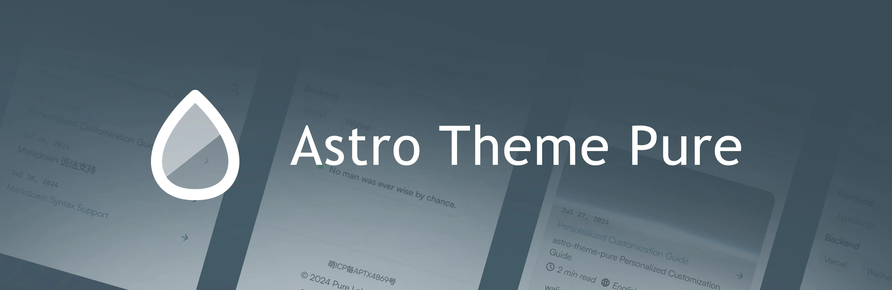
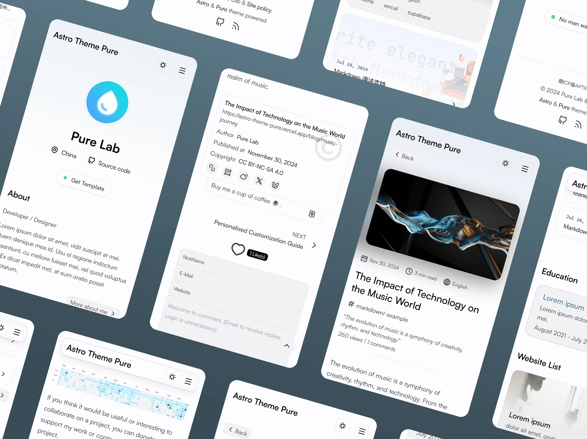

# Astro Theme Pure

[](https://astro-pure.js.org/)
[](https://www.npmjs.com/package/astro-pure)
[](https://github.com/cworld1/astro-theme-pure/releases)
[](https://github.com/cworld1/astro-theme-pure/blob/main/LICENSE)




> **Thông báo**
> 
> Repo này là bản **tuỳ chỉnh** dựa trên [Astro Theme Pure](https://github.com/cworld1/astro-theme-pure) của tác giả [@cworld1](https://github.com/cworld1).  
> Mình đã chỉnh sửa và bổ sung một số thành phần, giao diện và cấu hình để phù hợp hơn với nhu cầu cá nhân.
> 
> Bản gốc sử dụng UnoCSS từ v4.0.2 trở lên. Nếu muốn dùng bản ổn định hơn, có thể tham khảo [v4.0.1-beta](https://github.com/cworld1/astro-theme-pure/tree/v4.0.1-beta).

## Giới thiệu

Demo bản gốc: [astro-pure.js.org](https://astro-pure.js.org/)  
Demo bản tuỳ chỉnh: *(thay link của bạn vào đây)*

### :fire: Tính năng chính

- [x] 🚀 Hiệu năng cao, tải nhanh
- [x] ⭐ Giao diện đơn giản, sạch sẽ
- [x] 📱 Thiết kế responsive
- [x] 🔍 Tìm kiếm toàn site bằng [pagefind](https://pagefind.app/)
- [x] 🗺️ Sitemap & RSS
- [x] 🕷️ Tối ưu SEO
- [x] 📚 Mục lục (TOC)
- [x] 🖼️ Tạo ảnh Open Graph tự động cho bài viết
- [x] 🖼️ Mediumzoom lightbox cho ảnh

### :package: Thành phần

Theme có nhiều component sẵn, có thể dùng cho dự án này hoặc các dự án Astro khác (yêu cầu [UnoCSS](https://uno.css)).

- Thành phần cơ bản: `Aside`, `Tabs`, `Timeline`, `Steps`, `Spoiler`...
- Thành phần nâng cao: `GithubCard`, `LinkPreview`, `Quote`, `QRCode`...

### :white_check_mark: Lighthouse score

[](https://pagespeed.web.dev/analysis/https-cworld-top/o229zrt5o4?form_factor=mobile&hl=en)

## Tài liệu

- [Docs bản gốc](https://astro-pure.js.org/docs)
- [Showcase bản gốc](https://github.com/cworld1/astro-theme-pure/issues/10)

## Cài đặt và phát triển local

**Yêu cầu môi trường:**

- [Node.js](https://nodejs.org/): 18.0.0+
- [Bun](https://bun.sh/)

**Cách chạy:**

```shell
git clone <link-repo-của-bạn>
cd <tên-thư-mục-repo>
```

```shell
# Cài dependencies
bun install
```

```shell
# Chạy dev server
bun dev
```

```shell
# Build dự án
bun run build
```

```shell
# Xem trước bản build
bun preview
```

```shell
# Tạo bài viết mới
bun new-post
```

## Lời cảm ơn

- [Astro Cactus](https://github.com/chrismwilliams/astro-theme-cactus)
- [Astro Resume](https://github.com/srleom/astro-theme-resume)
- [Starlight](https://github.com/withastro/starlight)

## Giấy phép

Bản gốc Astro Theme Pure được phát hành theo giấy phép Apache 2.0.
Phiên bản tuỳ chỉnh này vẫn tuân thủ giấy phép đó.
Xem giấy phép gốc tại: [LICENSE gốc](https://github.com/cworld1/astro-theme-pure/blob/main/LICENSE)

[](https://star-history.com/#cworld1/astro-theme-pure&Date)