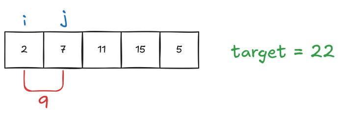
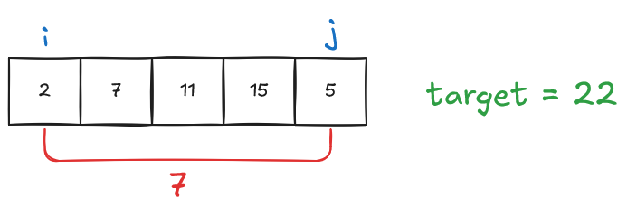
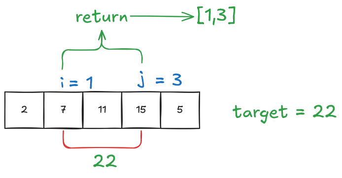
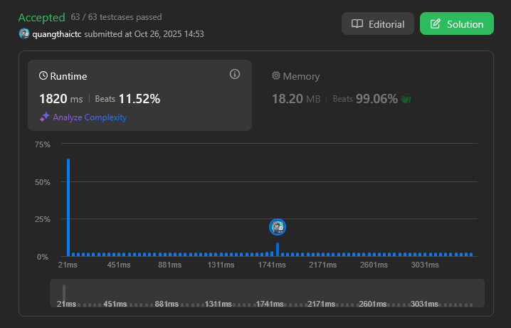
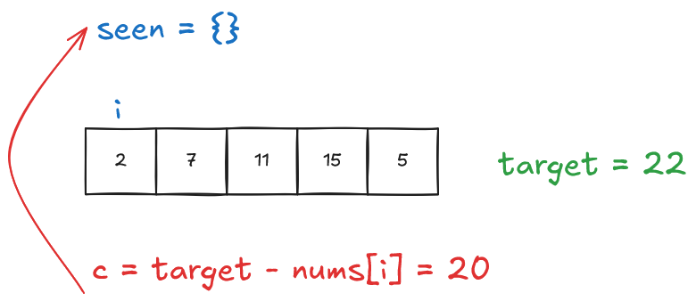
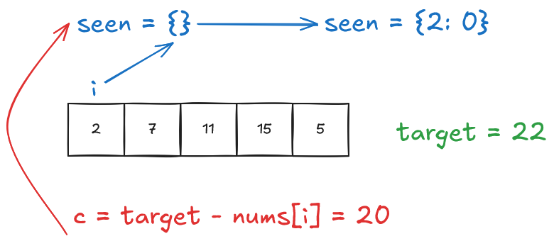
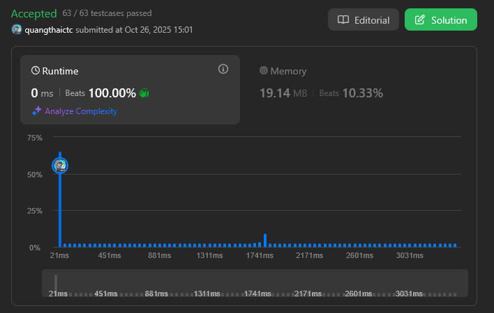

import { Aside } from 'astro-pure/user'

<Aside title='Vấn đề' type='note'>
Cho một mảng `nums` và số nguyên `target`, hãy trả về **các chỉ số** của 2 số sao cho tổng của chúng bằng `target`.

Bạn có thể giả định rằng mỗi bộ dữ liệu đầu vào sẽ có **chính xác một lời giải**, và bạn không thể sử dụng cùng một phần tử hai lần.

Bạn có thể trả về kết quả theo bất kỳ thứ tự nào.

Ví dụ 1:

>**Input:** nums = [2,7,11,15], target = 9
>
>**Output:** [0,1]
>
>**Giải thích:** Vì nums[0] + nums[1] == 9, ta trả về [0, 1].

Ví dụ 2:

>**Input:** nums = [3,2,4], target = 6
>
>**Output:** [1,2]

Ví dụ 3:

>**Input:** nums = [3,3], target = 6
>
>**Output:** [0,1]

[Chi tiết](https://leetcode.com/problems/two-sum/)
</Aside>

## Ý tưởng ban đầu - Brute Force

Mình thực hiện duyệt mảng bằng 2 vòng lặp lồng nhau với `i` sẽ bắt đầu từ đầu mảng và `j` sẽ bắt đầu từ `i + 1`.



Sau đó thực hiện kiểm tra xem tổng của hai số có bằng `target` hay không. Nếu không thì tăng vị trí và lại công việc.



Khi tìm thấy cặp số phù hợp, trả về chỉ số của hai số.



### Code

```python
def twoSum(self, nums: List[int], target: int) -> List[int]:
        for i in range(len(nums)):
            for j in range(i + 1, len(nums)):
                if nums[i] + nums[j] == target:
                    return [i, j]
```

### Đánh giá

Đối với cách giải này, độ phức tạp thuật toán là O(n^2). Với một số **test case** lớn thì thời gian thực thi sẽ lâu hơn.



## Tối ưu giải pháp

Để tối ưu mình sử dụng kỹ thuật `Hash Map`. Mình khởi tạo một hash map `seen` chứa vị trí của những số đã duyệt qua, với mỗi vòng lặp mình thực hiện tính số còn lại cần tìm.

```
Số cần tìm = target - nums[i]
```

Sau đó kiểm tra xem số đó có tồn tại trong `seen` chưa.



Nếu chưa tồn tại, mình thêm vị trí của số hiện tại đang duyệt vào `seen` tại vị trí là giá trị của số hiện tại.



Lặp lại công việc đến khi tìm thấy số phù hợp, sau đó trả về vị trí của số và vị trị i hiện tại.


### Code 

```python
def twoSum(self, nums: List[int], target: int) -> List[int]:
        seen = {}
        for i, num in enumerate(nums):
            c = target - num
            if c in seen:
                return [seen[c], i]
            seen[num] = i
```

### Đánh giá

Với cách tối ưu này độ phức tạp thuật toán giảm từ O(n^2) xuống còn O(n) nên thời gian thực thi nhanh hơn rất nhiều.

