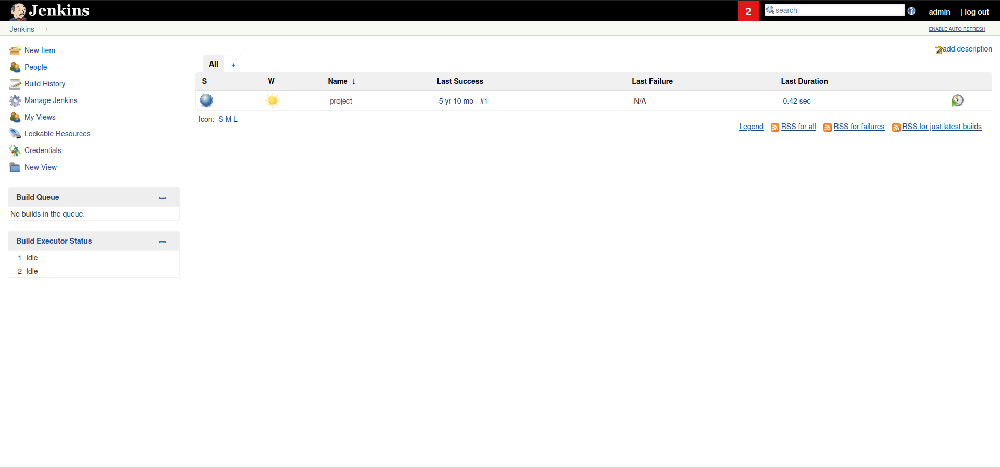
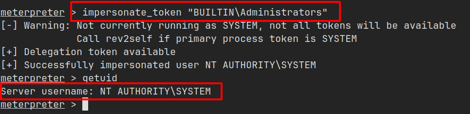

import { Aside } from 'astro-pure/user'

<Aside type="note" title='Thông tin về Alfred'>
Trong lab này sẽ thực hiện khai thác các cấu hình sai trên các server tự động hóa phổ biến (Jenkins - Công cụ này được sử dụng để tạo các pipeline CI/CD, cho phép deverloper tự động triển khai code ngay sau khi có thay đổi). Sau đó, thực hiện leo thang đặc quyền để lấy quyền truy cập `SYSTEM`.

Vì đây là ứng dụng Windows nên sẽ sử dụng [_Nishang_](https://github.com/samratashok/nishang). Repository này chứa tập hợp các script hữu ích để chiếm quyền truy cập ban đầu, thu thập thông tin và leo thang đặc quyền. Trong trường hợp này sẽ kết hợp sử dụng [reverse shell script](https://github.com/samratashok/nishang/blob/master/Shells/Invoke-PowerShellTcp.ps1)

[Link lab](https://tryhackme.com/room/alfred)
</Aside>

## Truy cập ban đầu

Sử dụng công cụ `nmap` mình phát hiện 3 port TCP đang mở, trong đó có 2 port đang chạy dịch vụ web.

```shell
PORT     STATE SERVICE            VERSION
80/tcp   open  http               Microsoft IIS httpd 7.5 # [!code highlight:1]
| http-methods: 
|_  Potentially risky methods: TRACE
|_http-server-header: Microsoft-IIS/7.5
|_http-title: Site doesn't have a title (text/html).
3389/tcp open  ssl/ms-wbt-server? # [!code highlight:1]
| ssl-cert: Subject: commonName=alfred
| Not valid before: 2025-09-10T04:19:14
|_Not valid after:  2026-03-12T04:19:14
|_ssl-date: 2025-09-11T04:23:03+00:00; 0s from scanner time.
8080/tcp open  http               Jetty 9.4.z-SNAPSHOT # [!code highlight:1]
| http-robots.txt: 1 disallowed entry 
|_/
|_http-server-header: Jetty(9.4.z-SNAPSHOT)
|_http-title: Site doesn't have a title (text/html;charset=utf-8).
Service Info: OS: Windows; CPE: cpe:/o:microsoft:windows
```

Đối với port `80`, kiểm tra sơ qua thì mình không tìm thấy gì đặc biệt.


Tại port `8080` xuất hiện một trang đăng nhập, kiểm tra sơ bộ thì không có lỗ hổng gì nên mình sử dụng `Burp Suite` để brute force tài khoản.


Các request có thông tin đăng nhập sai sẽ được chuyển hướng đến `/loginError` nên mình sẽ thêm xử lý để phân biệt giữa request đăng nhập không thành công và đăng nhập thành công.


Các thành phần mình thực hiện brute force như sau:

- [Danh sách Usernames](https://github.com/danielmiessler/SecLists/blob/master/Usernames/top-usernames-shortlist.txt).
- [Danh sách Passwords](https://github.com/danielmiessler/SecLists/blob/master/Passwords/Default-Credentials/default-passwords.txt).
- **Cluster bomb attack:** loại này sẽ brute force đối với mỗi dòng của danh sách 1 sẽ thử với tất cả các dòng của danh sách 2.

Khi brute force sẽ có một request không chuyển hướng đến `/loginError` mà chuyển hướng đến `/` và đây cũng là `username` và `password` hợp lệ.


Dùng nó để đăng nhập thì mình được chuyển hướng đến dashboard của `admin`.



Khám phá một xíu thì mình phát hiện bên trong có một trang cho phép thực thi lệnh trên hệ thống và trả kết quả.


Mình thực thi lệnh sau để mở `reverse shell`, lệnh này có 2 nhiệm vụ:

- Đầu tiên kết nối đến `Simple HTTP Server` của mình và tải script thực hiện kết nối ngược (reverse shell) về máy mình.
- Tiếp theo thực thi script đó và bắt đầu kết nối.


`Simple HTTP Server` mình mở tại port `6565` khi thực thi lệnh sẽ thấy script đã được tải.


Đồng thời khi tải xong, tại `netcat` mình đang mở listener ở port `7304` cũng đã thực hiện kết nối thành công và mình đã chiếm được quyền truy cập ban đầu ở người dùng `bruce`.


Flag được đặt tại thư mục `Desktop` của người dùng này.


## Chuyển đổi shell

Để có thể linh hoạt hơn khi sử dụng shell, thay vì dùng `raw shell` mình sẽ sử dụng `Metasploit` để nâng cấp lên `meterpreter shell`.

Lệnh mà mình sẽ thực thi trên web sẽ tải về một file độc hại từ máy mình.


Trước đó, mình sử dụng `msfvenom` tạo một file độc hại sử dụng để kết nối ngược về máy mình và nâng cấp lên `meterpreter shell`.


Khi server web thực thi và tải về file độc hại mà mình đã tạo, mình sẽ tạo một `listener` bằng công cụ `msfconsole` với module `exploit/multi/handler` kèm payload `windows/meterpreter/reverse_tcp`.


Mọi thứ đã chuẩn bị xong, mình quay trở lại session `netcat` lúc nãy và chạy file `rv-shell.exe` **_(Start-Process rv-shell.exe)_** mà server đã tải về.

Khi file này được thực thi, một `reverse shell` đã kết nối thành công và được nâng cấp lên `meterpreter shell`.


## Leo thang đặc Quyền

Bây giờ, mình sẽ dùng kỹ thuật `mạo danh token` để chiếm quyền `SYSTEM`.

Windows sử dụng các token để đảm bảo các tài khoản có đúng quyền để thực hiện các hành động cụ thể. Token thường được gán cho tài khoản khi người dùng đăng nhập hoặc được xác thực. Điều này thường được thực hiện bởi `lsass.exe`.

Access token này bao gồm:

- User SIDs (Security Identifier).
- Group SIDs
- Đặc quyền

Đọc thêm [tại đây](https://docs.microsoft.com/en-us/windows/win32/secauthz/access-tokens)

Có 2 loại access token:

- Primary access tokens: được liên kết với tài khoản người dùng và được tạo khi đăng nhập.
- Impersonation tokens: cho phép một tiến trình cụ thể (hoặc luồng trong tiến trình) có quyền truy cập vào các tài nguyên bằng cách sử dụng token của người dùng khác.

Đối với impersonation token, có nhiều cấp độ khác nhau:

- SecurityAnonymous: người dùng hiện tại không thể mạo danh người dùng khác.
- SecurityIdentification: người dùng hiện tại có thể lấy danh tính và đặc quyền của người dùng khác nhưng không thể mạo danh.
- SecurityImpersonation: người dùng có thể mạo danh bối cảnh bảo mật trên hệ thống cục bộ (local system).
- SecurityDelegation: người dùng có thể mạo danh bối cảnh bảo mật trên hệ thống từ xa (remote system).

Các đặc quyền của một tài khoản (được cấp cho tài khoản khi được tạo hoặc kế thừa từ một nhóm) cho phép người dùng thực hiện các hành động cụ thể. Một số đặc quyền bị làm dụng phổ biến nhất:

- SeImpersonatePrivilege
- SeAssignPrimaryPrivilege
- SeTcbPrivilege
- SeBackupPrivilege
- SeRestorePrivilege
- SeCreateTokenPrivilege
- SeLoadDriverPrivilege
- SeTakeOwnershipPrivilege
- SeDebugPrivilege

Đọc thêm [tại đây](https://www.exploit-db.com/papers/42556)

Sử dụng lệnh `whoami /priv` mình nhận được một số đặc quyền đang được cho phép như:

- SeDebugPrivilege 
- SeChangeNotifyPrivilege 
- SeImpersonatePrivilege 
- SeCreateGlobalPrivilege


Sử dụng module `incognito` để khai thác lỗ hổng này.

Mình liệt kê các tokens hiện có thì phát hiện token `BUILTIN\Administrators`.


Sau đó mình thực hiện mạo danh token này và chiếm được quyền `SYSTEM`.



Flag sẽ nằm tại `c:\Windows\System32\config\`


<Aside type="caution" title='Lưu ý'>
Mặc dù có token với đặc quyền cao nhất, điều đó không có nghĩa là có đặc quyền của người dùng đó.

Điều này là do cách Windows xử lý các quyền - nó sử dụng **Primary Token** của tiến trình và không phải là **Impersonation token** để có thể xác định tiến trình có thể hoặc không thể làm gì.

Phải đảm bảo đang `migrate` vào tiến trình với quyền tương ứng.
</Aside>