## Thu thập thông tin

### Nmap scan

Thực hiện scan port, mình phát hiện port `SSH` và `HTTP`.

```shell
PORT     STATE SERVICE VERSION
22/tcp   open  ssh     OpenSSH 8.2p1 Ubuntu 4ubuntu0.13 (Ubuntu Linux; protocol 2.0) # [!code highlight:1]
| ssh-hostkey: 
|   3072 3a:a5:a9:5d:99:42:02:dd:dc:7e:7e:5b:d8:1c:02:e2 (RSA)
|   256 dc:6a:a1:d9:92:8c:82:ac:a8:48:f1:08:ca:77:29:96 (ECDSA)
|_  256 a4:1d:94:f6:a2:b6:fb:da:10:e9:69:db:c5:31:8a:26 (ED25519)
8000/tcp open  http    Werkzeug httpd 2.0.2 (Python 3.8.10) # [!code highlight:1]
|_http-title:  Login 
|_http-server-header: Werkzeug/2.0.2 Python/3.8.10
Service Info: OS: Linux; CPE: cpe:/o:linux:linux_kernel
```

Truy cập vào port `8000` mình được chuyển đến trang `login`.

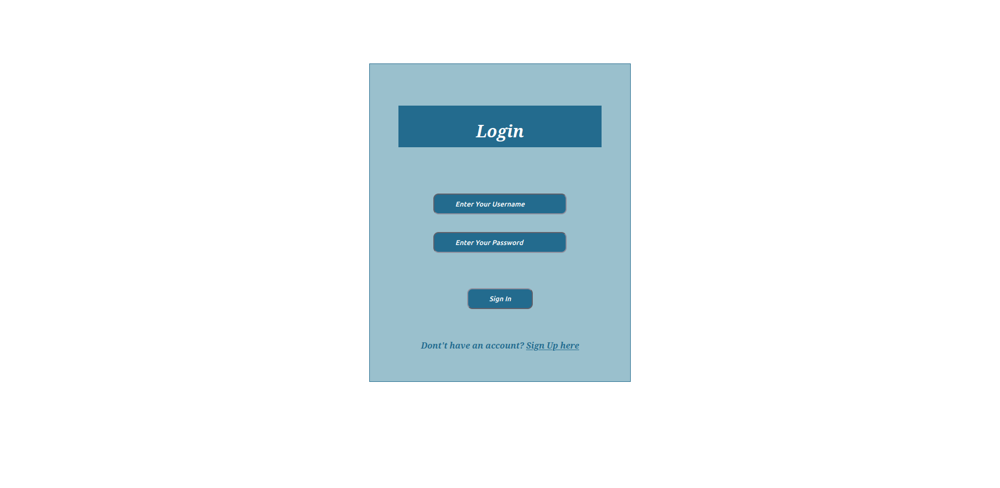

### Kiểm tra SQL Injection

Khi mình chèn một ký tự đặc biệt vào trường `username` thì website trả về lỗi.

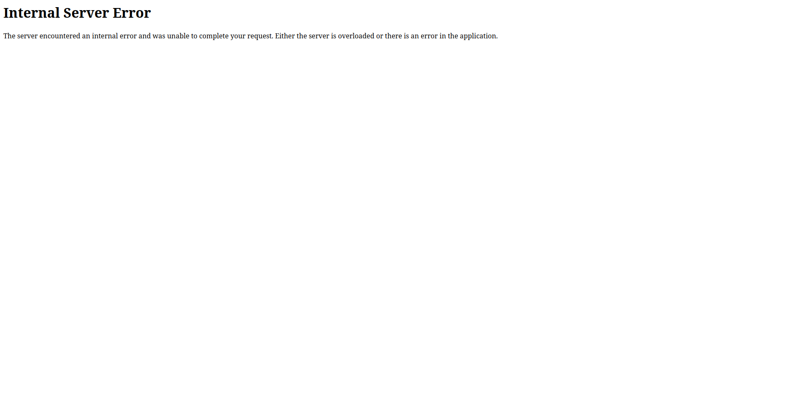

Mình thử với một payload `SQL Injection`.

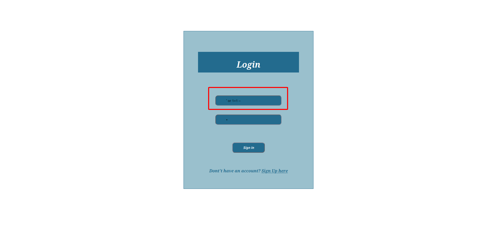

Kết quả là mình vào được `index page` với tên người dùng `smokey`.

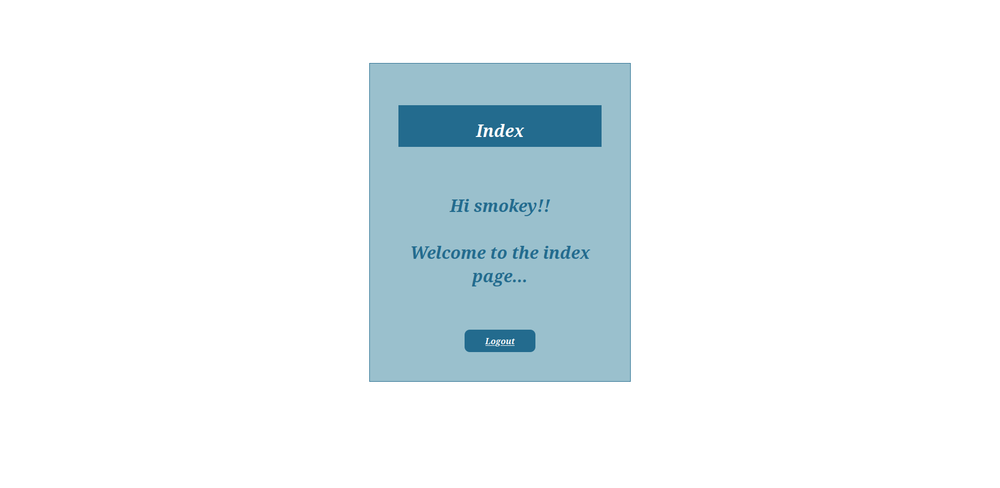

## Flag 1

### SQL Map

Xác định được đây là lỗ hổng `SQL Injection`, mình sử dụng công cụ `SQL Map` để trích xuất dữ liệu thì nhận được dữ liệu từ bảng `users` với 3 cột `email`, `username`, `password`.

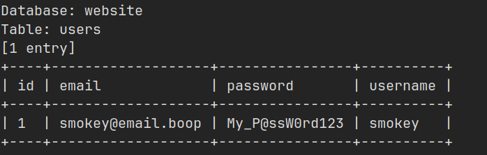

### Truy cập người dùng smokey

Sử dụng thông tin này để kết nối SSH thì mình đã truy cập được vào người dùng `smokey`.

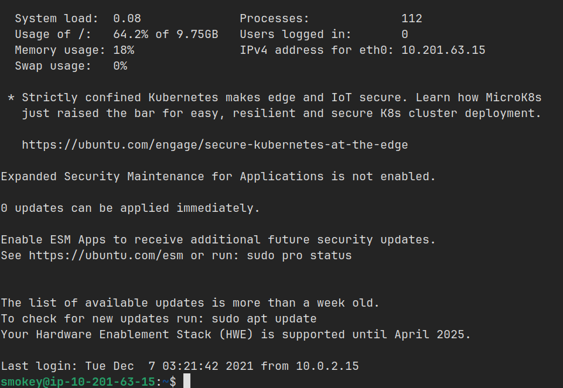

Và mình tìm được flag tại thư mục `home` của người dùng `hazel`.

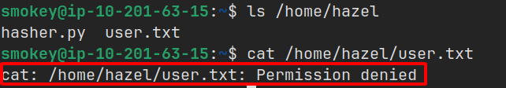

Tới đây mình...BÍ!

### Truy cập người dùng hazel và flag

Xem hint của thử thách thì mình nhận được 2 chữ `Weak password`

...

Sau một khoảng thời gian nho nhỏ, mình xác định được thông tin đăng nhập của người dùng `hazel` và password là `hazel`.

SSH vào người dùng này và mình nhận được flag.

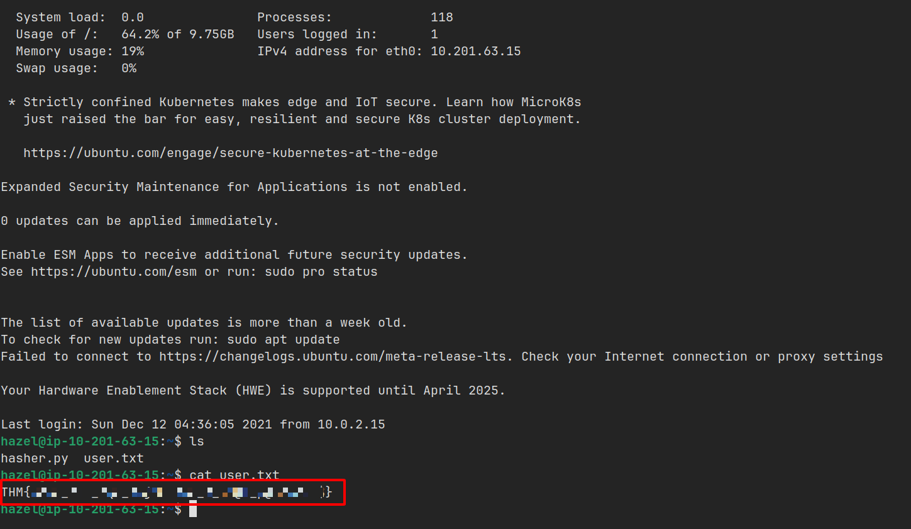

## Flag 2

### Sudo Misconfiguration (Python)

Mình sử dụng lệnh `sudo -l` xem mình có thể dùng sudo cho những gì, thì tại đây mình được dùng `sudo` cho `python3` và file `hasher.py`.

Vấn đề nằm ở chỗ là mình không có quyền ghi vào file `hasher.py`.

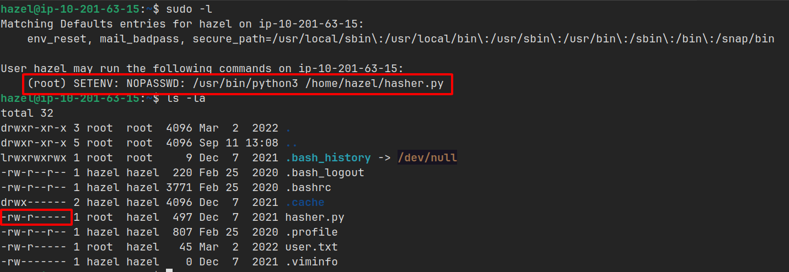

Nhưng khi mở file lên, mình nhận ra mình có thể sử dụng `PYTHONPATH` và giả mạo `hashlib` này.

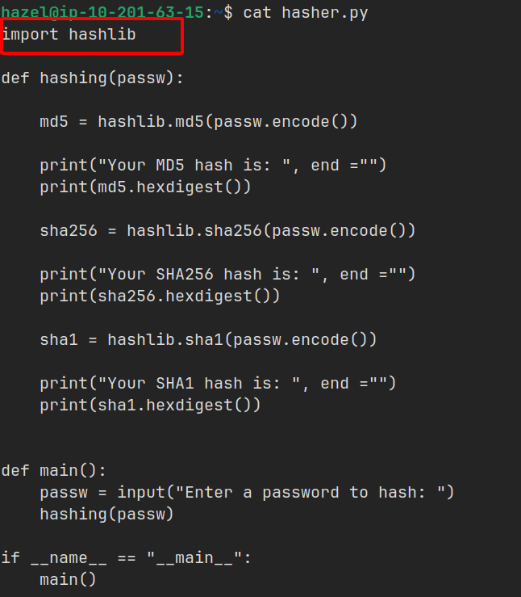

Mình tạo một file `hashlib.py` với mục đích mở một shell mới và đặt nó tại thư mục `/tmp`.

### Truy cập người dùng root và flag

Sau đó thực thi file `hasher.py` với quyền sudo kèm theo `PYTHONPATH=/tmp`, khi file được thực thi `python` sẽ dựa vào `PYTHONPATH` để tìm kiếm thư viện và trỏ tới thư mục `/tmp` và thực thi file `hashlib.py` giả mạo mình tạo ra nhằm mở một shell mới dưới quyền sudo (root).

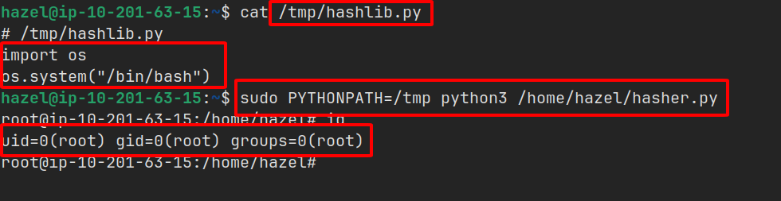

Cuối cùng, mình tìm thấy flag tại thư mục `root`.

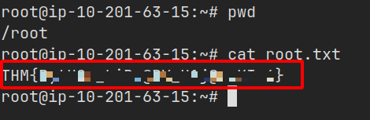
