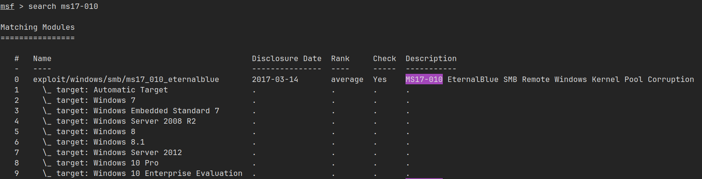
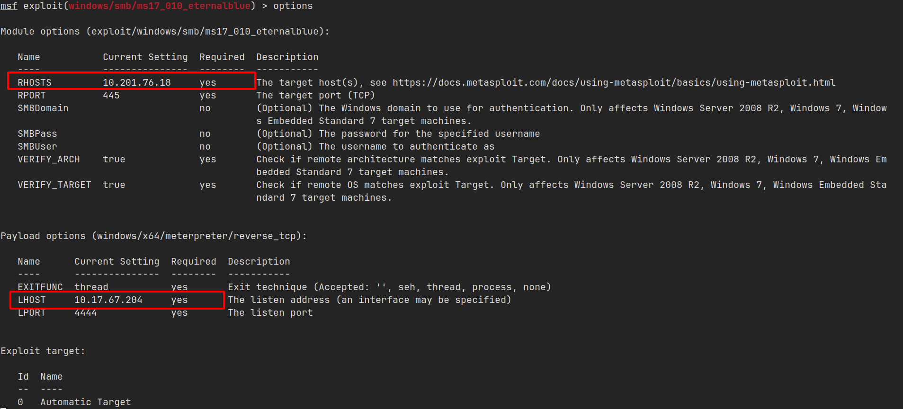
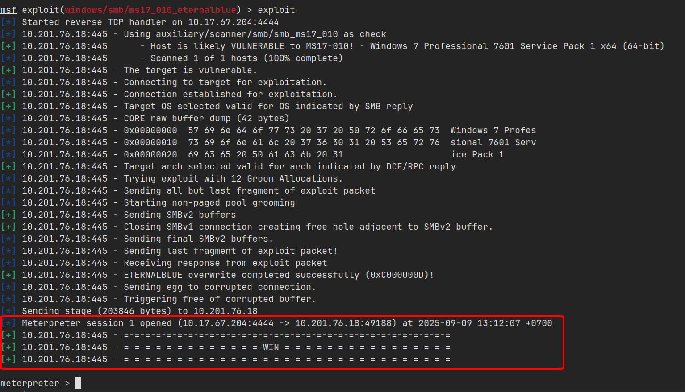
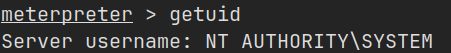
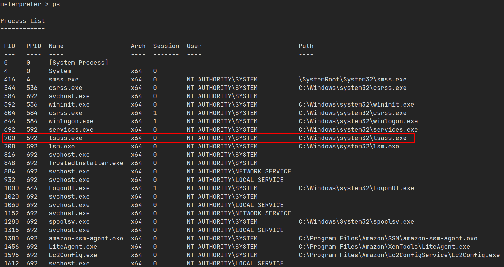
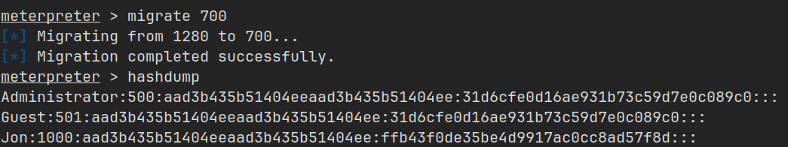
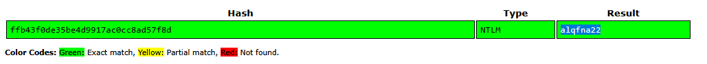
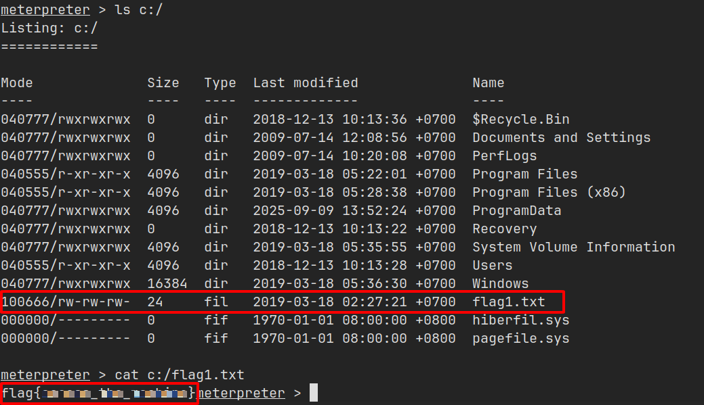
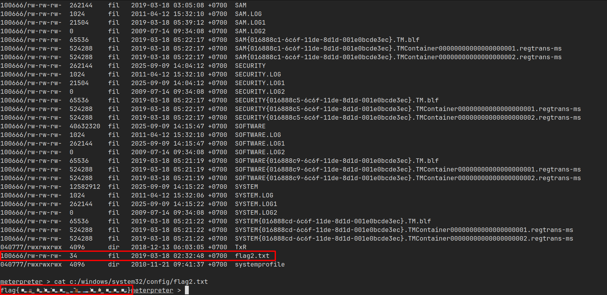
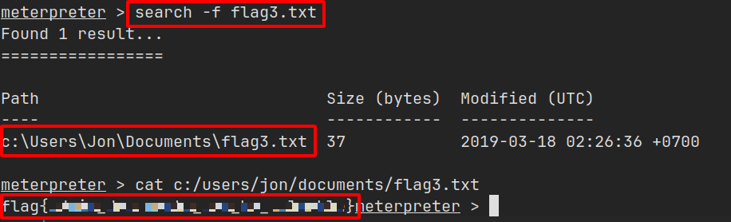

import { Aside } from 'astro-pure/user'

<Aside type="note" title='Thông tin về Blue'>
Đây là lab tập trung vào việc sử dụng công cụ [_**Metasploit**_](https://www.metasploit.com/) để khai thác lỗ hổng và kiểm soát quyền truy cập trên hệ điều hành Windows.

[Link lab](https://tryhackme.com/room/blue)
</Aside>

## Thu thập thông tin

Đầu tiên, mình cần thu thập thông tin về mục tiêu có IP `10.201.76.18`.

Sử dụng công cụ `nmap` với cú pháp như sau:

```bash
nmap -n -Pn -p-1000 10.201.76.18

# -n        Không phân giải tên miền => Giảm thời gian scan
# -Pn       Bỏ qua host discovery (ping) => Scan port trực tiếp
# -p-1000   Scan từ port 1-1000
```

Mình thu được kết quả 3 port đang mở.

```bash
PORT    STATE SERVICE
135/tcp open  msrpc
139/tcp open  netbios-ssn
445/tcp open  microsoft-ds
```

Sử dụng thêm tùy chọn `-sV` để xem thông tin phiên bản.

```bash
PORT    STATE SERVICE      VERSION
135/tcp open  msrpc        Microsoft Windows RPC
139/tcp open  netbios-ssn  Microsoft Windows netbios-ssn
445/tcp open  microsoft-ds Microsoft Windows 7 - 10 microsoft-ds (workgroup: WORKGROUP) # [!code highlight:1]
Service Info: Host: JON-PC; OS: Windows; CPE: cpe:/o:microsoft:windows
```

Port **SMB (445)**, sử dụng phiên bản `Microsoft Windows 7 - 10 microsoft-ds (workgroup: WORKGROUP)`.

Tìm trên [ExploitDB](https://www.exploit-db.com/), đây là phiên bản có một lỗ hổng khá nổi còn có tên là `MS17-010 EternalBlue` cho phép thực thi lệnh từ xa và khai thác thông qua cổng của dịch vụ SMB.

## Chiếm quyền truy cập

Sau khi có thông tin về lỗ hổng, mình sử dụng công cụ `Metasploit` thực hiện khai thác và chiếm quyền truy cập.



Tại đây mình sử dụng `module 0 (exploit/windows/smb/ms17_010_eternalblue)`.

Mình đặt các tùy chọn `RHOSTS` (IP mục tiêu), `LHOST` (IP máy tấn công) và theo mặc định payload sẽ dùng module `windows/x64/meterpreter/reverse_tcp`:



Sau quá trình công cụ tự động khai thác, kết quả trả về cho thấy đã chiếm quyền truy cập thành công và đã được nâng cấp lên `meterpreter shell`.

Giả sử nếu không sử dụng payload meterpreter từ đầu thì để thực hiện nâng cấp shell thông thường lên meterpreter có thể sử dụng module `post/multi/manage/shell_to_meterpreter` .



<Aside type="tip" title='Meterpreter shell'>
**Meterpreter** là một payload do **Metasploit** phát triển. Cung cấp một **shell nâng cao** chạy trong bộ nhớ (RAM), cho phép quản lý file, process, network và thực hiện nhiều hành động hậu khai thác mà một shell thông thường không có.

Vì chạy trong RAM nên nó sẽ **khó bị phát hiện hơn** so với việc truy cập và tương tác trên shell thông thường.
</Aside>

Kết quả của lệnh `getuid` cũng cho thấy mình đang thực thi với quyền SYSTEM (Quyền cao nhất của Windows).



Tiếp theo, mình dùng lệnh `ps` để xem các tiến trình đang chạy thì trong đó tiến trình có `PID 700` đang chạy dịch vụ `lsass.exe` **(Local Security Authority Subsystem Service - dịch vụ này có nhiệm vụ xác thực người dùng đăng nhập vào máy, xử lý thay đổi mật khẩu và tạo access token).**



Mình thực hiện `migrate` vào tiến trình này để chuẩn bị cho bước tiếp theo.

## Cracking

Sau khi `migrate` vào tiến trình có `PID 700`, mình thực thi `hashdump` để lấy danh sách người dùng kèm theo hash mật khẩu của họ.



Đối với người dùng `Administrator` và `Guest` có hash `31d6cfeOd16ae931b73c59d7eOc089cO` đồng nghĩa các người dùng này có mật khẩu rỗng.

Người dùng `Jon` có hash mật khẩu là `ffb43f0de35be4d9917ac0cc8ad57f8d`.

Sử dụng công cụ giải hash, mình nhận được mật khẩu của `Jon` là `alqfna22`



## Tìm flags!

Đây là nhiệm vụ cuối của lab này là tìm 3 flag với 3 câu hỏi.

> Flag1? _This flag can be found at the system root._

`System root` có nghĩa là vị trí cấp đầu tiên của cây thư mục, vì đây là Windows nên root sẽ là ổ `C`.



> Flag2? _This flag can be found at the location where passwords are stored within Windows._

Vị trí các mật khẩu được lưu trên Windows tại `C:/Windows/System32/config`.

Theo Wikipedia thì các file registry sau được lưu tại đây:

- Sam (HKEY_LOCAL_MACHINE\SAM)
- Security (HKEY_LOCAL_MACHINE\SECURITY)
- Software (HKEY_LOCAL_MACHINE\SOFTWARE)
- System (HKEY_LOCAL_MACHINE\SYSTEM)
- Default (HKEY_USERS\.DEFAULT)



> Flag3? _This flag can be found in an excellent location to loot. After all, Administrators usually have pretty interesting things saved._

Thật ra thì...nhìn vào tên của 2 file flag mình vừa tìm được thì cũng đoán được flag 3 có tên gì rồi :v

Vì đang thực hiện với quyền `SYSTEM` nên mình có toàn quyền đối với hệ thống này, kể cả flag 1 và 2 cũng có thể làm cách này nhưng vì lý do học tập thì 2 cách trên là cách làm hợp lý hơn.

