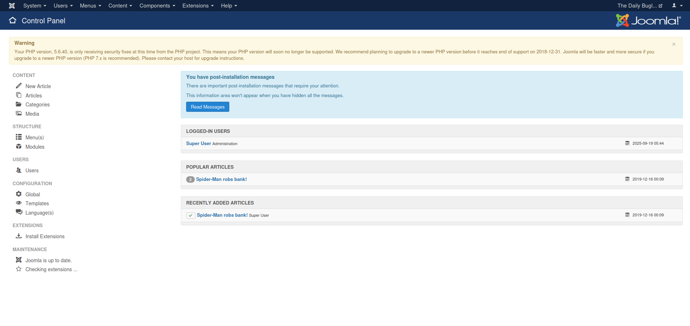
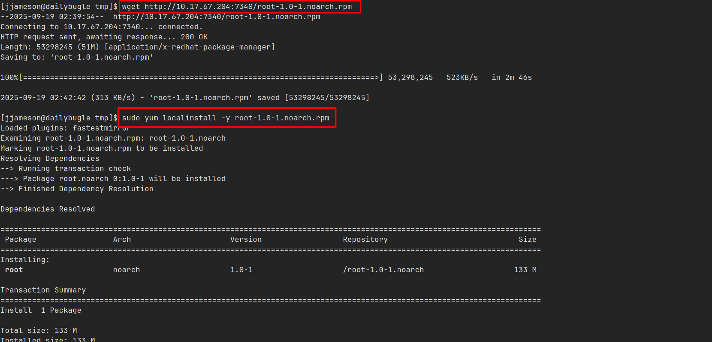

## Thu thập thông tin

Truy cập vào mục tiêu thì đây là trang báo lá cải của `Daily Bugle` (fan Spider-man sẽ khá quen thuộc với chỗ này).

Trang này có một bài với tiêu đề _**"Spider-Man cướp ngân hàng!"**_ và bên cạnh có một form đăng nhập.

Và ở `/robots.txt` có leak về trang `/administrator`.

Sau khi tìm hiểu thì mình tìm thấy một công cụ của `OWASP` có tên là `JoomScan` dành riêng cho CMS này. Nó có thể thu thập thông tin phiên bản, lỗ hổng dựa trên phiên bản,...

Sử dụng công cụ, phiên bản của Joomla CMS là `3.7.0`.

Ở phiên bản này tồn tại lỗ hổng SQLi.

Lỗ hổng này được báo cáo và cách khai thác như sau:

## Flag 1

### Truy cập người dùng apache

Mình sử dụng công cụ `SQLmap` để khai thác lỗ hổng này và trích xuất được database `joomla` có 72 bảng dữ liệu.

Nhưng mình đã thử nhiều cách vẫn không dump dữ liệu của các bảng này được.

Do đó, mình tìm kiếm thêm thông tin thì thấy có PoC này có script `python` khai thác và dump bảng `users` và `session`.

Khi thực thi file, mình tìm được thông tin của người dùng `Jonah` kèm theo một hash mật khẩu.

Sử dụng công cụ `John the Ripper` với wordlist `rockyou.txt` thì mình giải hash này ra được mật khẩu gốc.

Sử dụng thông tin đăng nhập này, mình đăng nhập vào `/administrator` thì được chuyển đến trang `Control Panel`.

Ở trang `Templates` mình phát hiện ở đây quản lý các template được dựng bằng PHP và có thể thực thi nó.

Tại đây, mình sử dụng reverse shell của [pentestmonkey](https://pentestmonkey.net/tools/web-shells/php-reverse-shell) và chèn vào tempalte này.

Sau khi chọn `Tempalte Preview`, file này sẽ thực thi và kết nối đến listener netcat của mình.

Nhưng quyền hiện tại không thể truy cập đến thư mục `/home` của `jjameson`.

### Truy cập người dùng jjameson và flag

Khi mình tìm trong thư mục của webserver, mình phát hiện bên trong file `configuration.php` có thông tin `user` và `password`. Nhưng dùng để đăng nhập thì không được.

Tuy nhiên, khi mình dùng mật khẩu này đăng nhập vào `jjameson` thì thành công và tìm thấy flag tại thư mục `/home` của người dùng này.

## Flag 2

### Sudo Misconfiguration (Yum)

Từ `jjameson` mình thấy trong danh sách `sudo` người dùng này có thể thực thi `yum` với `sudo` mà không cần mật khẩu.

Tại [GTFOBins](https://gtfobins.github.io/gtfobins/yum/) có hướng dẫn cách tận dụng `yum` để thực hiện leo thang đặc quyền.

Từ thông tin trên, mình thực hiện tạo `package` với lệnh ghi `jjameson ALL=(ALL:ALL) NOPASSWD:ALL` vào file quản lý quyền `sudo` và nó sẽ cho phép `jjameson` tất cả các quyền thực thi bằng sudo mà không cần mật khẩu.

### Truy cập người dùng root và flag

Mọi thứ đã chuẩn bị xong, mình chuyển file này sang máy mục tiêu và cài đặt `package` vào máy thông qua tùy chọn `localinstall` của `yum`.

Khi cài đặt thành công, mình đã có mọi thứ mình muốn, có thể chuyển sang `root` dễ dàng và lấy flag tại thư mục `/root`.

