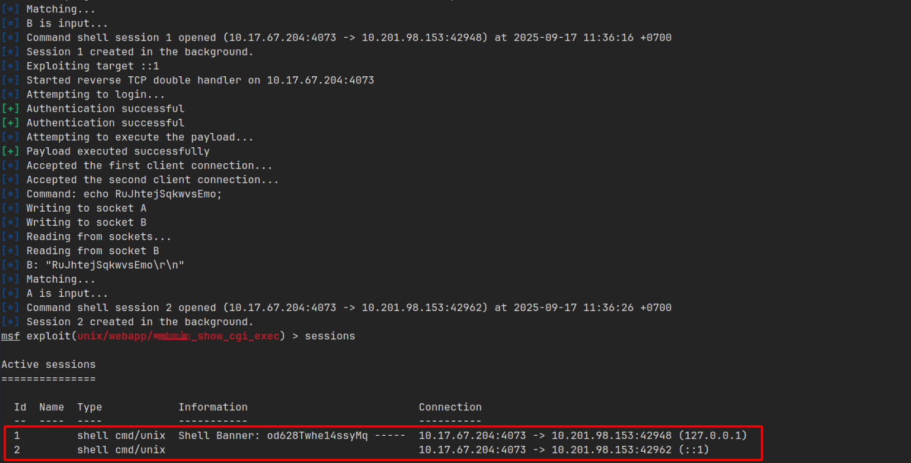

import { Aside } from 'astro-pure/user'

<Aside type="note" title='Thông tin về Game Zone'>
Đây là lab thực hiện khai thác lỗ hổng SQL injection thủ công và sử dụng công cụ SQLMap, giải mã mật khẩu của người dùng, sử dụng SSH để tìm một dịch vụ ẩn và sử dụng [_**Metasploit**_](https://www.metasploit.com/) để leo thang đặc quyền lên root.

[Link lab](https://tryhackme.com/room/gamezone)
</Aside>

## Chiếm quyền truy cập thông qua SQLi

Khi truy cập vào mục tiêu, tại trang chủ có một form đăng nhập.


Tại đây tồn tại lỗ hổng `SQLi`, mình chèn `' or 1=1 -- ` vào ô `username` để bypass đăng nhập.

Khi thực thi thành công mình được chuyển tới trang `/portal`, đồng thời xác nhận được lỗ hổng SQLi đang tồn tại ở trang này.


## Công cụ SQLMap

Lưu request lúc nãy vào file `request.txt` và sử dụng công cụ `SQLMap` khai thác và trích xuất dữ liệu.


Sau khi khai thác xong, mình trích xuất được 2 bảng như sau:

```bash
Database: db
Table: users
[1 entry]
+------------------------------------------------------------------+----------+
| pwd                                                              | username |
+------------------------------------------------------------------+----------+
| ab5db915fc9cea6c78df88106c6500c57f2b52901ca6c0c6218f04122c3efd14 | agent47  |
+------------------------------------------------------------------+----------+

Database: db
Table: post
[5 entries]
+----+--------------------------------+--------------------------------------------------------------------------------------------------------------------------------------------------------------------------------------------------------+
| id | name                           | description                                                                                                                                                                                            |
+----+--------------------------------+--------------------------------------------------------------------------------------------------------------------------------------------------------------------------------------------------------+
| 1  | Mortal Kombat 11               | Its a rare fighting game that hits just about every note as strongly as Mortal Kombat 11 does. Everything from its methodical and deep combat.                                                         |
| 2  | Marvel Ultimate Alliance 3     | Switch owners will find plenty of content to chew through, particularly with friends, and while it may be the gaming equivalent to a Hulk Smash, that isnt to say that it isnt a rollicking good time. |
| 3  | SWBF2 2005                     | Best game ever                                                                                                                                                                                         |
| 4  | Hitman 2                       | Hitman 2 doesnt add much of note to the structure of its predecessor and thus feels more like Hitman 1.5 than a full-blown sequel. But thats not a bad thing.                                          |
| 5  | Call of Duty: Modern Warfare 2 | When you look at the total package, Call of Duty: Modern Warfare 2 is hands-down one of the best first-person shooters out there, and a truly amazing offering across any system.                      |
+----+--------------------------------+--------------------------------------------------------------------------------------------------------------------------------------------------------------------------------------------------------+
```

Tại bảng `users` có một người dùng `agent47` với mật khẩu được hash thành:

```
ab5db915fc9cea6c78df88106c6500c57f2b52901ca6c0c6218f04122c3efd14
```

Ngoài ra còn có một bảng khác chứa thông tin các bài đăng.

## Giải mã mật khẩu với JohnTheRipper

Mình sử dụng công cụ `JohnTheRipper` để giải mã mật khẩu này kèm wordlist `rockyou.txt`.


Sau khi có đầy đủ tên đăng nhập và mật khẩu, mình SSH vào tài khoản này.


Và tại thư mục `home` của người dùng này mình tìm được flag.


## Mở truy cập dịch vụ qua reverse SSH


`Reverse SSH port forwarding` chỉ định một port trên `remote server` sẽ được chuyển tiếp đến host và port đã cho ở phía cục bộ

Tại đây mình sẽ dùng công cụ `ss` để kiểm tra các socket trên máy mục tiêu.


Ý nghĩa các tham số như sau:

- -t	Hiển thị TCP sockets
- -u	Hiển thị UDP sockets
- -l	Chỉ hiển thị listening sockets
- -p	Hiển thị process đang dùng socket
- -n	Không phân giải tên dịch vụ

Tại máy tấn công, mình sử dụng `SSH tunel` với tùy chọn `-L` để mở kết nối từ port `10000` đến máy mục tiêu.


Khi kết nối thành công, mình truy cập vào web với địa chỉ `localhost:10000`.


Mình sử dụng thông tin đăng nhập của `agent47` để đăng nhập vào web này thì truy cập vào được trang thông tin hệ thống, tại thanh tiêu đề của trang này sẽ có thông tin về phiên bản của nó.


## Leo thang đặc quyền bằng Metasploit

Từ các thông tin tìm được, mình tra cứu trên [ExploitDB](https://www.exploit-db.com) thì thấy phiên bản của CMS này có một lỗ hổng dẫn đến kiểm soát truy cập.

Tìm trên `msfconsole` thì có module `exploit/unix/webapp/x_show_cgi_exec` hỗ trợ khai thác.


Một số thông tin yêu cầu phải đặt để có thể khai thác như sau:


Khai thác thành công, `msfconsole` tạo cho mình 2 session.



Mình truy cập vào `session 1` tại đây mình đã có shell với quyền `root` và flag được đặt tại thư mục `/root`.

