import { Aside } from 'astro-pure/user'

<Aside type="note" title='Thông tin về HackPark'>
Đây là lab thực hiện brute force các thông tin đăng nhập tài khoản, xử lý các khai thác công khai, sử dụng [_**Metasploit**_](https://www.metasploit.com/) framework và leo thang đặc quyền trên Windows.

[Link lab](https://tryhackme.com/room/hackpark)
</Aside>

## Sử dụng Hydra brute force trang đăng nhập

Mình tìm một trang đăng nhập để tấn công và xác định yêu cầu mà form thực hiện cho webserver. Thông thường, webserver thực hiện 2 loại request, **GET** request được sử dụng để yêu cầu dữ liệu từ webserver và **POST** request dùng để gửi dữ liệu đến webserver.

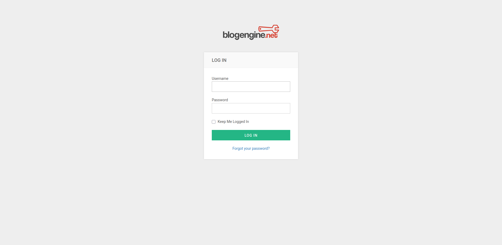

Thực hiện tìm `username` bằng chức năng quên mật khẩu của website.

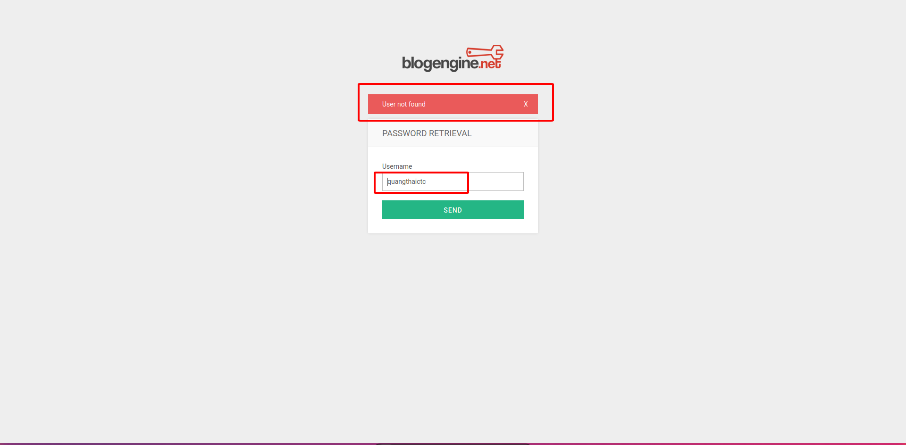

Nếu `username` tồn tại, webserver sẽ thực hiện gửi thông tin về email của người dùng đó và sẽ có kết quả trả về khác lúc nãy dù hiện tại đang lỗi.

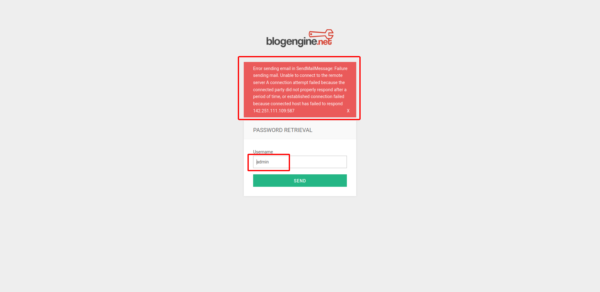

Với `hydra` mình sửa dụng cú pháp:

```bash
hydra -l <USERNAME> -P <PASWORD-WORDLIST> http-post-form "<PATH-URL>:<DATA>:<CONDITION>"

# -l                Sử dụng -L nếu muốn dùng wordlist username.
# http-post-form:
#           Phần data sử dụng ^USER^ và ^PASS^ để công cụ hiểu đang cần chèn username và password vào chỗ nào.
#           Phần condition có cú pháp:
#                   - S:<Condition> nếu điều kiện đúng (Success - Ví dụ S:200 OK => Trả về kết quả nếu request trùng khớp.)
#                   - F:<Condition> nếu điều kiện sai (Fail - Ví dụ F:404 Not found => Bỏ qua các request trùng khớp.)
```

Mình tìm được mật khẩu của người dùng `admin`

```bash
[80][http-post-form] host: 10.201.59.2   login: admin   password: 1*a*2w*x
```

## Chiếm quyền kiểm soát

Sử dụng thông tin đăng nhập tìm được mình vào được trang `Administrator`.

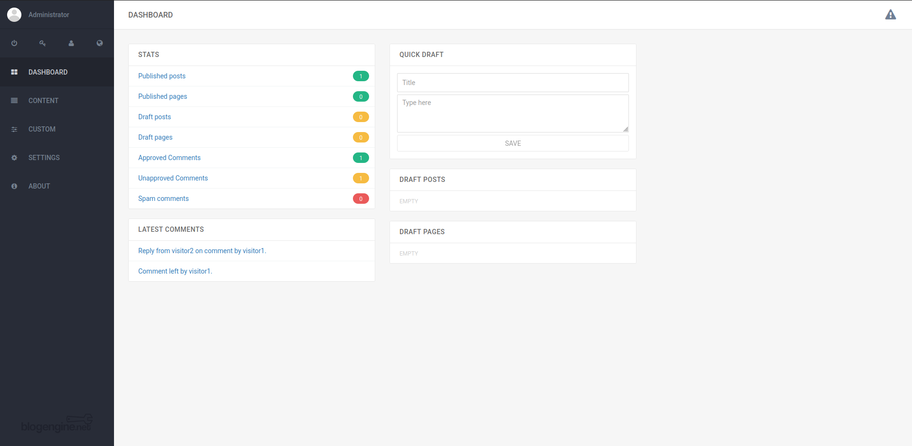

Thông tin phiên bản của `BlogEngine` này tồn tại `CVE-2019-6714` cho phép thực thi mã từ xa từ lỗ hổng `Path Traversal`.

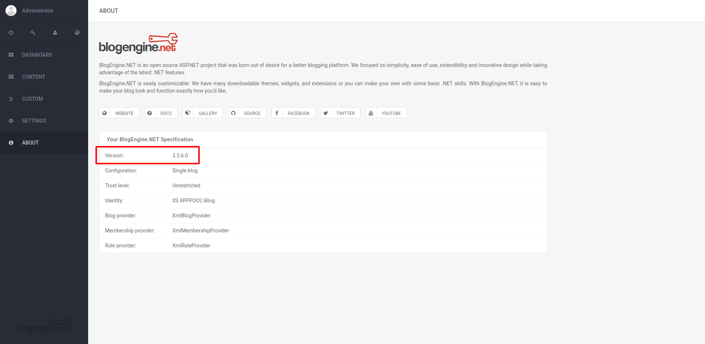

Sử dụng bản khai thác khai thác [tại đây](https://www.exploit-db.com/exploits/46353) mình thực hiện chiếm quyền kiểm soát webserver này.

Tại đây mình chiếm được quyền kiểm soát vào `iis apppool\blog`.

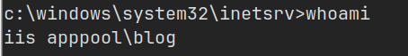

## Leo thang đặc quyền sử dung Metasploit

Sau khi có được quyền truy cập ban đầu, mình sử dụng `msfvenom` tạo một file độc hại nhằm tạo một `reverse shell` và nâng cấp shell này lên `meterpreter`.

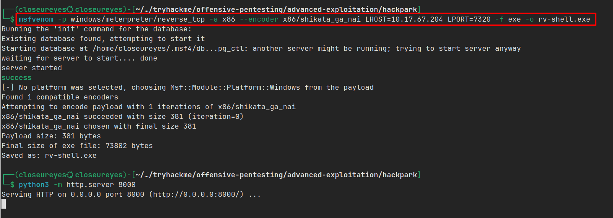

Tại máy mục tiêu mình tải file này về và thực thi nó.

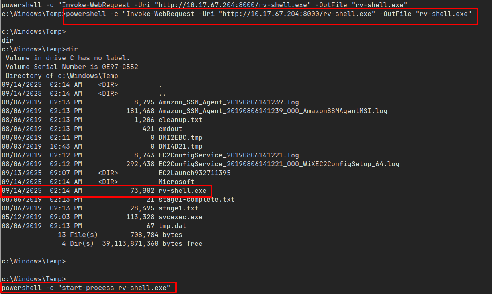

Đồng thời, mình mở một listener `msfconsole` với module `windows/meterpreter/reverse_tcp` và khi bên máy mục tiêu thực thi file thành công thì mình sẽ có được `meterpreter shell`.

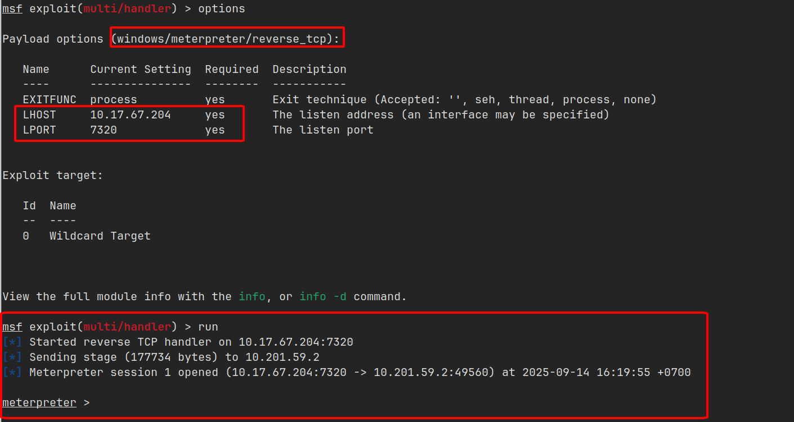

Kiểm tra sơ qua, máy này có thông tin phiên bản là `Windows Server 2012 R2 (6.3 Build 9600)`.

Trong đó có một dịch vụ gọi là `WindowsScheduler` có khả năng khai thác, và tại thư mục này mọi người dùng đều có quyền `đọc/ghi/sửa`.

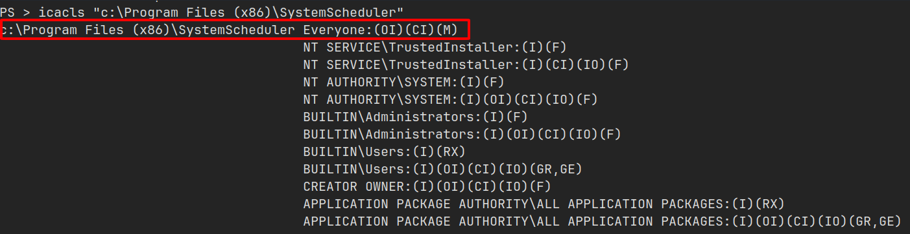

Kiểm tra các file log, mình phát hiện có một event thực thi `Message.exe` cứ mỗi 30 giây với quyền `Administrator`.

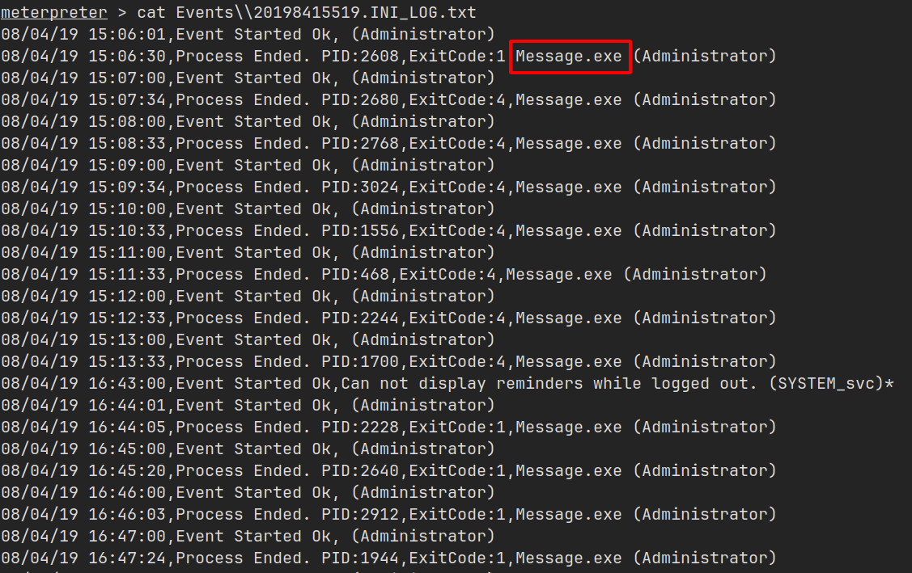

Từ các thông tin trên, mình sử dụng `msfvenom` tạo một file độc hại giả mạo file `Message.exe` với mục đích `reverse shell` về máy mình và mở HTTP Server cho bước tiếp theo.

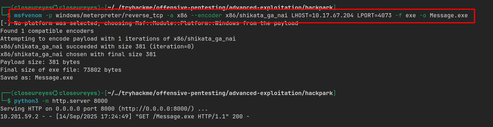

Tại máy mục tiêu mình đổi tên file gốc thành `Message.exe.bak` (Phòng trường hợp mình làm lỗi gì đó thôi) và tải file độc hại từ máy mình qua, sau đó đợi `WindowsScheduler` thực thi (khoảng 30 giây).

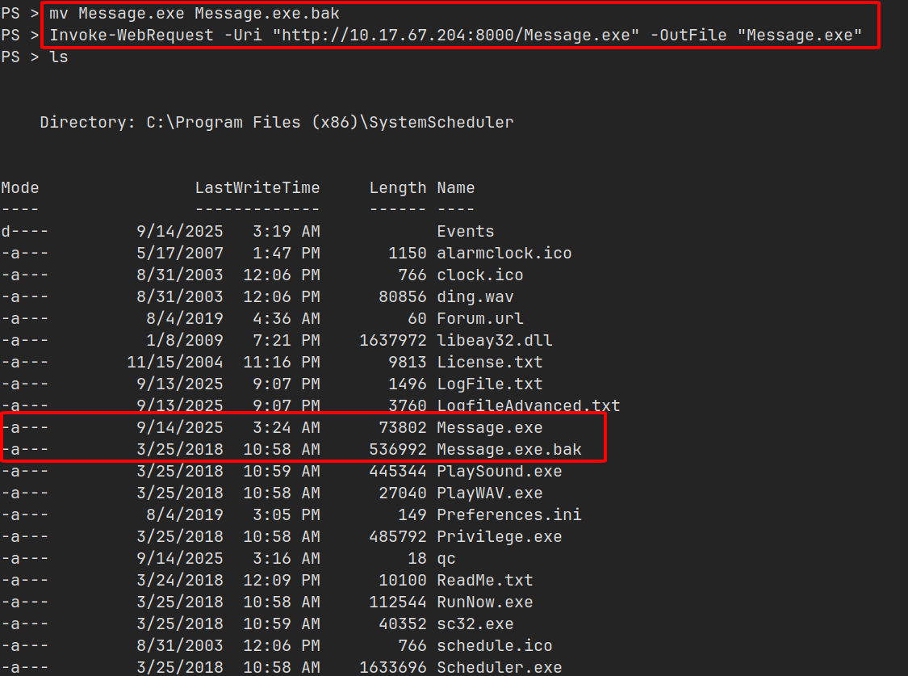

Khi file được thực thi, mình sẽ có được `meterpreter shell` với quyền `Administrator`.

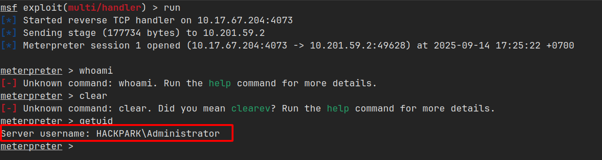

Quyền này chỉ nhỏ hơn `SYSTEM` thôi nên mình có thể truy cập vào thư mục `Desktop` của `Jeff` và xem flag trong file `user.txt`.

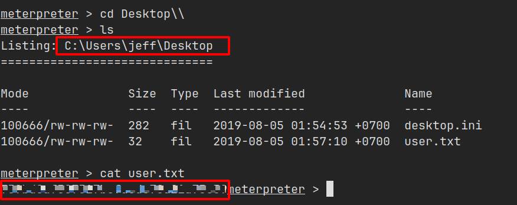

Cuối cùng mình lấy được flag trong file `root.txt` tại thư mục `Desktop` của `Administrator`.

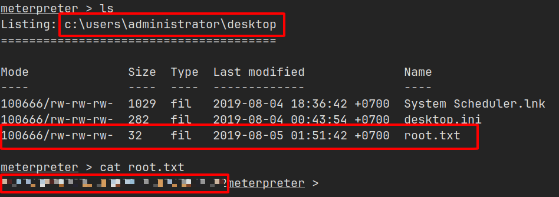