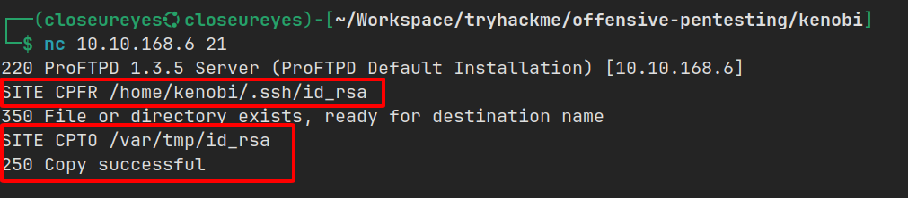

import { Aside } from 'astro-pure/user'

<Aside type="note" title='Thông tin về Kenobi'>
Đây là lab tập trung vào việc truy cập vào một share Samba, khai thác lỗ hổng của một phiên bản ProFTPD và kiểm soát quyền truy cập trên hệ điều hành Linux.

[Link lab](https://tryhackme.com/room/kenobi)
</Aside>

## Thu thập thông tin Samba


_**Samba**_ được biết với sự linh hoạt về việc truy cập file giữa các hệ điều hành và còn được gọi là _**file system**_. Nó cho phép người dùng cuối truy cập, sử dụng các file và các tài nguyên chung được sử dụng trong mạng nội bộ hoặc internet.

_**Samba**_ được xây dựng trên giao thức client/server của _**SMB - Server Message Block**_. Nó chỉ được phát triển dành cho Windows, nếu không có Samba thì các nền tảng máy tính khác sẽ **không thể truy cập dù cùng một mạng**.

---

Đầu tiên, mình cần thu thập thông tin về mục tiêu có IP `10.10.78.65`.

Mình tìm được 7 cổng đang mở, trong đó có SMB.

```bash
PORT     STATE SERVICE
21/tcp   open  ftp # [!code highlight:1]
22/tcp   open  ssh
80/tcp   open  http
111/tcp  open  rpcbind # [!code highlight:1]
139/tcp  open  netbios-ssn
445/tcp  open  microsoft-ds # [!code highlight:1]
2049/tcp open  nfs
```

Sau đó, mình sửa dụng lệnh `smbclient -L` để thực hiện hiển thị các thư mục được share thì tìm được thư mục `anonymous`.


Kết nối vào thư mục `anonymous` và tìm thấy file `log.txt`.


Bên trong file log này chứa một số thông tin như:

- SSH key được tạo ra cho người dùng Kenobi
- ProFTPD server.

Trước đó trong kết quả scan, mình có scan ra port 111 chạy dịch vụ `rpcbind`.

<Aside type="tip" title='Giải thích rpcbind'>
Hiểu đơn giản thì mỗi khi một dịch vụ khởi động ở một port ngẫu nhiên và sẽ đi kèm một số (program number), khi người dùng muốn dùng sẽ phải thông qua `rpcbind` và lúc này `rpcbind` sẽ là người dẫn đường chỉ cho người dùng biết dịch vụ cần sử dụng đang ở port nào.
</Aside>

Trong trường hợp này, port 111 truy cập vào `file system`. 

Sử dụng lệnh `nmap -p 111 --script=nfs-ls,nfs-statfs,nfs-showmount 10.10.168.6` mình tìm được thư mục var.

```shell
PORT    STATE SERVICE
111/tcp open  rpcbind
| nfs-showmount: 
|_  /var *
```

## Chiếm quyền truy cập ban đầu với ProFtpd


`ProFTPD` là một FTP server mã nguồn mở và miễn phí, tương thích với hệ thống Unix và Windows. Trong quá khứ nó cũng có một số phiên bản tồn tại lỗ hổng.

Mình dùng lệnh `nmap -p 21 -n -Pn -sV 10.10.168.6` để xem thông tin phiên bản của `ProFTPD` thì đây là phiên bản `1.3.5`.

```shell
PORT   STATE SERVICE VERSION
21/tcp open  ftp     ProFTPD 1.3.5
```

Tìm trên [ExploitDB](https://www.exploit-db.com/), phiên bản này tồn tại một lỗ hổng dẫn tới kiểm soát quyền truy cập.

PoC sử dụng **CPFR (Copy from) **và **CPTO (Copy to) để **thao tác copy paste một file từ chỗ này sang khác bên trong FTP server.

Từ các thông tin thu thập được:

- File `log.txt` => biết được SSH key của người dùng Kenobi nằm tại `/home/kenobi/.ssh/id_rsa`.
- Thư mục `/var` mình có thể truy cập từ mạng.

Quy trình tấn công có thể hình dung như sau:

- Dùng `CPFR`, `CPTO` copy key SSH của Kenobi vào thư mục `/var`.
- Mount thư mục `/var` để có thể lấy SSH key về.
- Có SSH key thì SSH vào Kenobi => lấy quyền truy cập thành công.

Đầu tiên, mình thực hiện kết nối và copy file ra `/var`:



Tiếp theo, mount thư mục `/var`.


Cuối cùng, copy SSH key ra máy tấn công và thực hiện SSH vào `Kenobi`.


Khi SSH thành công, flag sẽ nằm tại thư mục home của `Kenobi`.


## Leo thang đặc quyền với biến môi trường


| Quyền | Trên các file | Trên các thư mục |
|-|-|-|
| SUID Bit | Người dùng thực thi file với quyền của _chủ sở hữu file_ | - |
| SGID Bit | Người dùng thực thi file với quyền của _chủ sở hữu nhóm_ | File tạo trong thư mục này sẽ có cùng _chủ sở hữu nhóm_ |
| Sticky Bit | - | Chỉ chủ sở hữu hoặc root mới được xóa file bên trong |

`SUID Bit` rất nguy hiểm, nếu một file nhị phân tồn tại `SUID Bit` nó sẽ có khả năng chạy với đặc quyền cao hơn.

Tại người dùng `Kenobi`, mình tìm các file có `SUID Bit` bằng cách thực thi lệnh:

```shell
find / -perm -u=s -type f 2>/dev/null
```

Và tại đây mình thấy một file nhị phân có thể sử dụng để leo thang đặc quyền.


Thực thi file này thử, thì mình xác định được đây là một file do `Kenobi` tạo ra.


Mình dùng lệnh `strings` để trích xuất các chuỗi bên trong file nhị phân này thì có 3 lệnh ứng với 3 option.


Mình nhận ra các lệnh này được chạy mà không bao gồm đường dẫn, khi gọi lệnh thì máy sẽ thực thi thông qua biến môi trường.

Từ đó, mình tạo một file thực thi **giả curl**, bên trong thực thi gọi một shell `/bin/sh` và cấp quyền cho file này (Đọc - Ghi - Thực thi).

Vì mình tạo file này tại thư mục `/tmp` nên mình xuất biến môi trường tại đây.


Khi thực thi file `/usr/bin/menu` và với tùy chọn 1, máy này sẽ thực thi `curl` nhưng sẽ là `curl giả` và thực thi `/bin/sh` với quyền root.

Sau khi chiếm được quyền truy cập vào root, flag sẽ nằm tại thư mục `/root`.


