import { Aside } from 'astro-pure/user'

## Thu thập thông tin

### Nmap scan

Sử dụng công cụ `nmap` mình tìm được 2 port HTTP và 1 port SMB có khả năng khai thác.

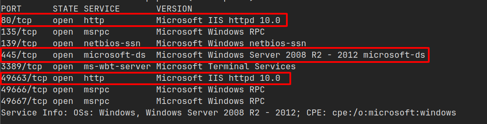

Truy cập vào 2 trang Web thì cả 2 đều có giao diện Web mặc định của IIS.

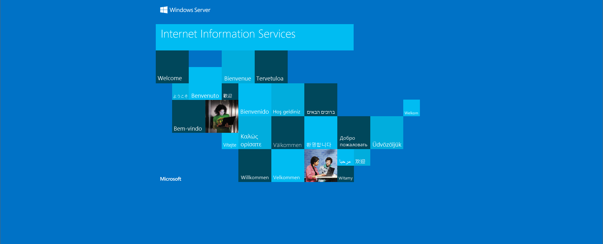

### Gobuster

Sử dụng công cụ `gobuster`, mình scan ra được một đường dẫn như sau:

```
/nt4wrksv             (Status: 301) [Size: 159]
```

Nhưng khi truy cập thì là một trang trống và không có gì.

### Dịch vụ SMB

Liệt kê danh sách thư mục share của mục tiêu, mình tìm thấy một thư mục giống như đường dẫn scan từ `gobuster`.

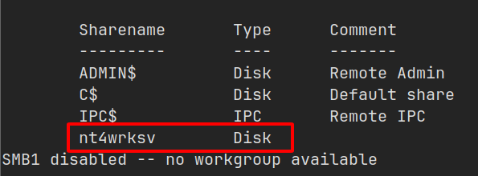

Truy cập vào thư mục này thì mình phát hiện một file tên `passwords.txt`, nhìn vào nội dung file thì đây là mật khẩu được mã hóa base64 khá quen thuộc.

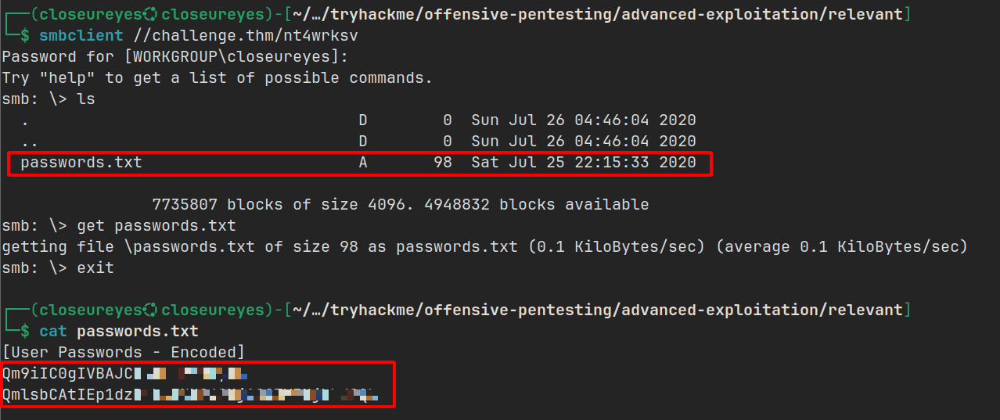

Giải ra thì mình nhận được mật khẩu của người dùng `Bob` và `Bill`.

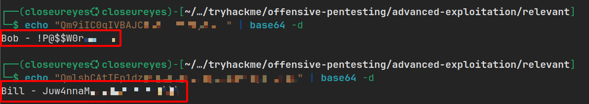

Mình cũng thử truy cập lại trang web với đường dẫn kèm file này, thì mình xác nhận được là nó đã truy cập cùng một thư mục.

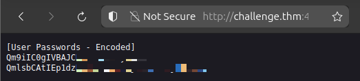

## Flag 1

### Upload reverse shell

Từ các thông tin tìm được, mình thực hiện upload một reverse shell với định dạng `.aspx` của [borjmz](https://github.com/borjmz/aspx-reverse-shell/raw/refs/heads/master/shell.aspx) vì đây là server IIS, nó sẽ hỗ trợ thực thi file này rất tốt.

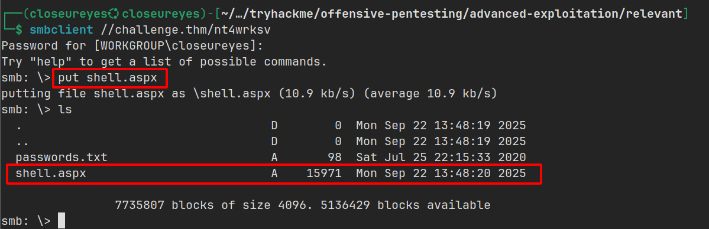

### Truy cập iis apppool và flag

Sau khi up load shell thành công, mình mở một listener netcat và truy cập vào file reverse shell vừa upload thì mình đã chiếm được quyền truy cập vào `iis apppool\defaultapppool`

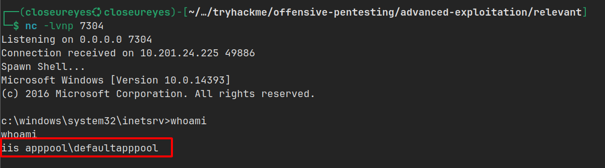

Và mình tìm thấy flag tại file `user.txt` trong thư mục `Desktop` của người dùng `Bob`.

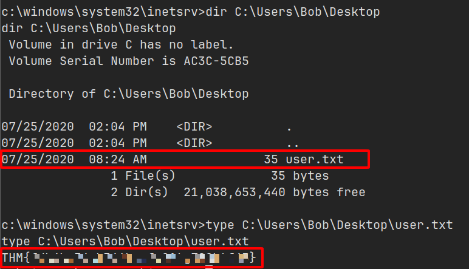

## Flag 2

### PrintSpoofer

Khi kiểm tra các đặc quyền của người dùng này, mình phát hiện đặc quyền `SeImpersonatePrivilege` đang `enabled`.

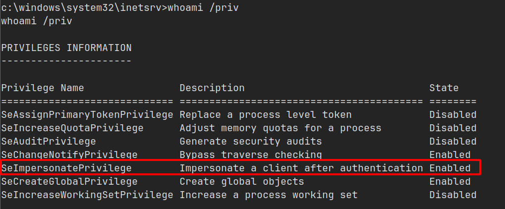

Có một bản khai thác công khai có tên [PrintSpoofer](https://github.com/itm4n/PrintSpoofer). Mình thực hiện chuyển file này sang máy mục tiêu và do trước đó mình dùng SMB nên không biết đường dẫn trong máy của file này nằm ở đâu nên mình tìm và thấy nó nằm tại `C:\inetpub\wwwroot\nt4wrksv`.

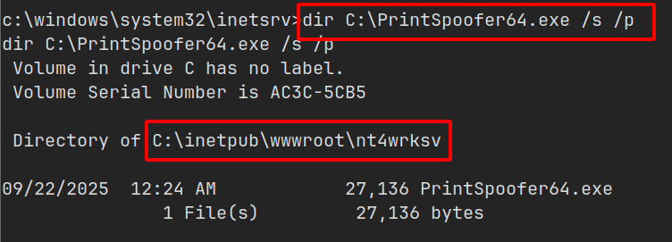

### Truy cập vào SYSTEM và flag

Thực thi file và mình đã chiếm được quyền truy cập vào `SYSTEM`.

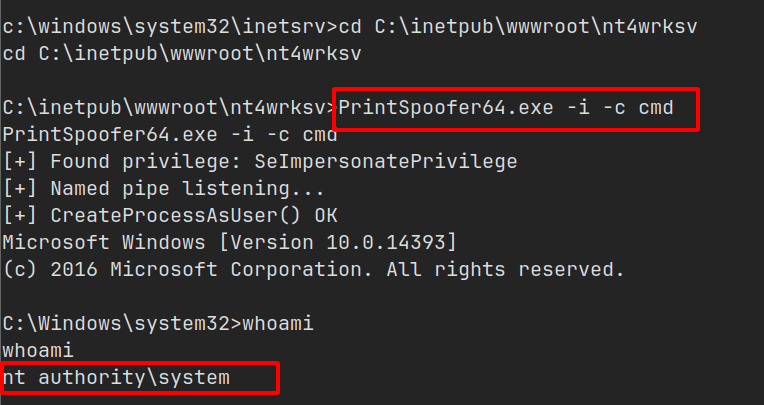

Cuối cùng mình tìm thấy flag tại thư mục `Desktop` của `Administrator`.

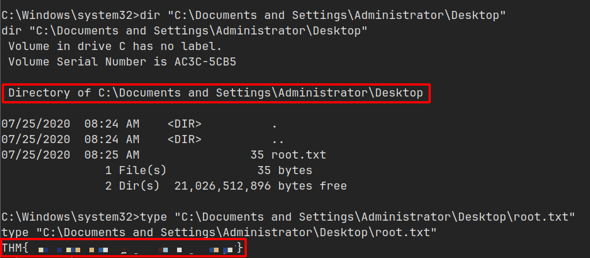