import { Aside } from 'astro-pure/user'

## Thu thập thông tin

### Nmap scan

Kết quả scan từ nmap mình thu được các thông tin như sau:

```bash
PORT    STATE SERVICE     VERSION
22/tcp  open  ssh         OpenSSH 7.2p2 Ubuntu 4ubuntu2.8 (Ubuntu Linux; protocol 2.0) # [!code highlight:1]
| ssh-hostkey: 
|   2048 99:23:31:bb:b1:e9:43:b7:56:94:4c:b9:e8:21:46:c5 (RSA)
|   256 57:c0:75:02:71:2d:19:31:83:db:e4:fe:67:96:68:cf (ECDSA)
|_  256 46:fa:4e:fc:10:a5:4f:57:57:d0:6d:54:f6:c3:4d:fe (ED25519)
80/tcp  open  http        Apache httpd 2.4.18 ((Ubuntu)) # [!code highlight:1]
|_http-server-header: Apache/2.4.18 (Ubuntu)
|_http-title: Skynet
110/tcp open  pop3        Dovecot pop3d # [!code highlight:1]
|_pop3-capabilities: PIPELINING UIDL RESP-CODES SASL AUTH-RESP-CODE CAPA TOP
139/tcp open  netbios-ssn Samba smbd 3.X - 4.X (workgroup: WORKGROUP)
143/tcp open  imap        Dovecot imapd # [!code highlight:1]
|_imap-capabilities: LOGIN-REFERRALS more IDLE SASL-IR capabilities have LOGINDISABLEDA0001 LITERAL+ Pre-login post-login IMAP4rev1 ENABLE listed ID OK
445/tcp open  netbios-ssn Samba smbd 4.3.11-Ubuntu (workgroup: WORKGROUP) # [!code highlight:1]
Service Info: Host: SKYNET; OS: Linux; CPE: cpe:/o:linux:linux_kernel

Host script results:
| smb-security-mode: 
|   account_used: guest
|   authentication_level: user
|   challenge_response: supported
|_  message_signing: disabled (dangerous, but default)
|_clock-skew: mean: 1h39m58s, deviation: 2h53m13s, median: -1s
| smb-os-discovery: 
|   OS: Windows 6.1 (Samba 4.3.11-Ubuntu)
|   Computer name: skynet
|   NetBIOS computer name: SKYNET\x00
|   Domain name: \x00
|   FQDN: skynet
|_  System time: 2025-09-17T03:42:42-05:00
| smb2-security-mode: 
|   3:1:1: 
|_    Message signing enabled but not required
|_nbstat: NetBIOS name: SKYNET, NetBIOS user: <unknown>, NetBIOS MAC: <unknown> (unknown)
| smb2-time: 
|   date: 2025-09-17T08:42:43
|_  start_date: N/A
```

### Website

Truy cập vào website mục tiêu thì ở trang chủ không có gì đặc biệt, giao diện không thực hiện được chức năng gì.

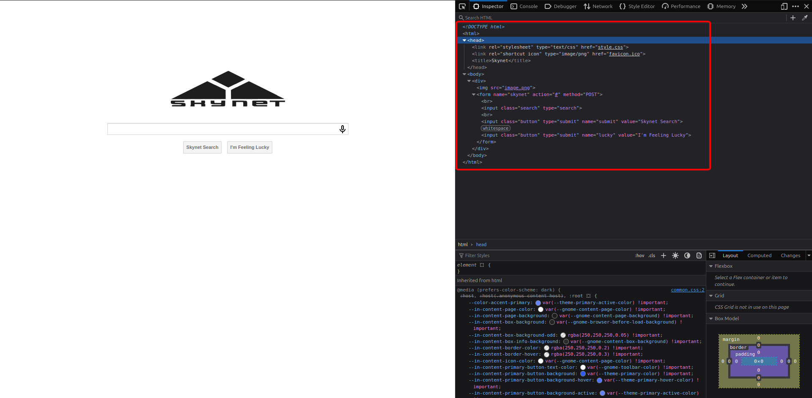

### Samba

Mình kiểm tra dịch vụ `Samba` có thư mục `anonymous` có thể truy cập được và bên trong có file `attention.txt` và thư mục `logs`.

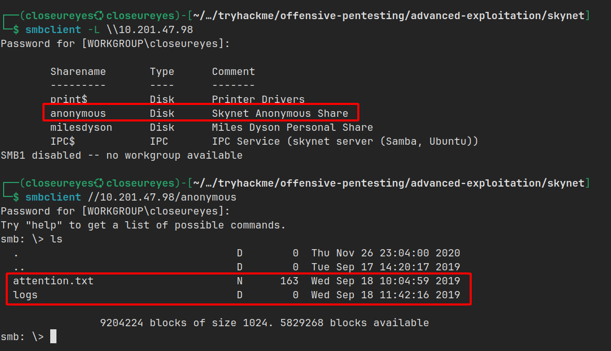

Bên trong file `attention.txt` có nội dung như sau:

> Một sự cố hệ thống gần đây đã khiến nhiều mật khẩu bị thay đổi. Tất cả nhân viên Skynet được yêu cầu đổi mật khẩu sau khi thấy thông báo này.
>
>– Miles Dyson

Tại thư mục `logs` có 3 file `log1.txt`, `log2.txt`, `log3.txt`.

Trong đó, `log2.txt` và `log3.txt` là file trống. Còn `log1.txt` có nội dung như sau:

```
cyborg007haloterminator
terminator22596
terminator219
terminator20
terminator1989
terminator1988
terminator168
terminator16
terminator143
terminator13
terminator123!@#
terminator1056
terminator101
terminator10
terminator02
terminator00
roboterminator
pongterminator
manasturcaluterminator
exterminator95
exterminator200
dterminator
djxterminator
dexterminator
determinator
cyborg007haloterminator
avsterminator
alonsoterminator
Walterminator
79terminator6
1996terminator
```

Nhìn vào danh sách này thì mình suy đoán khả năng là mật khẩu.

### Gobuster scan

Sử dụng công cụ `gobuster` để scan thư mục, mình tìm thấy một số thông tin như sau:

```bash
/admin                (Status: 301) [Size: 312] [--> http://10.201.47.98/admin/]
/css                  (Status: 301) [Size: 310] [--> http://10.201.47.98/css/]
/js                   (Status: 301) [Size: 309] [--> http://10.201.47.98/js/]
/config               (Status: 301) [Size: 313] [--> http://10.201.47.98/config/]
/ai                   (Status: 301) [Size: 309] [--> http://10.201.47.98/ai/]
/squirrelmail         (Status: 301) [Size: 319] [--> http://10.201.47.98/squirrelmail/]
```

Trong đó, tất cả đều trả về mã `403` (Không có quyền truy cập) nhưng chỉ có `/squirrelmail` truy cập được.


Từ các thông tin thu thập được, mình đã thử sử dụng username `milesdyson` là tên thư mục share lúc đầu tìm được và kết hợp với mật khẩu trong file `log1.txt` để brute force trang đăng nhập vào `SquirrelMail`.

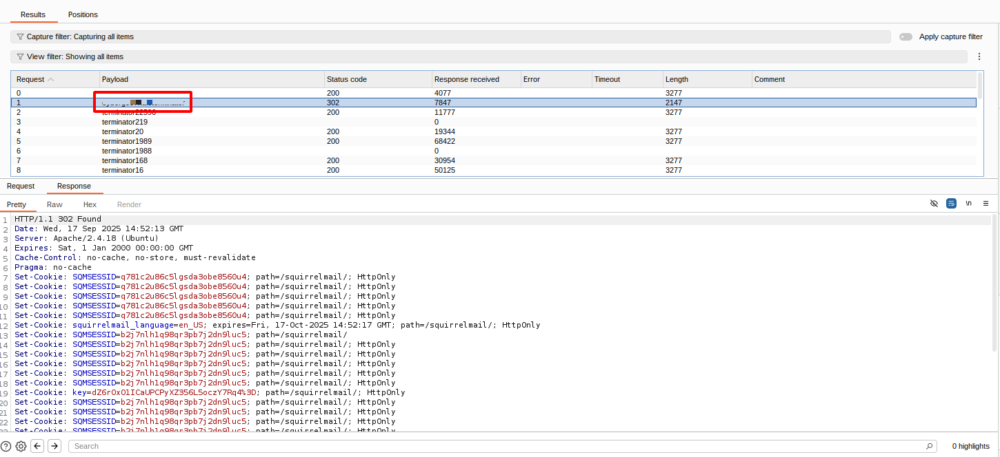

Khi đăng nhập vào, mình phát hiện một mail phản hồi về khi người dùng này yêu cầu reset mật khẩu dịch vụ `SMB`.

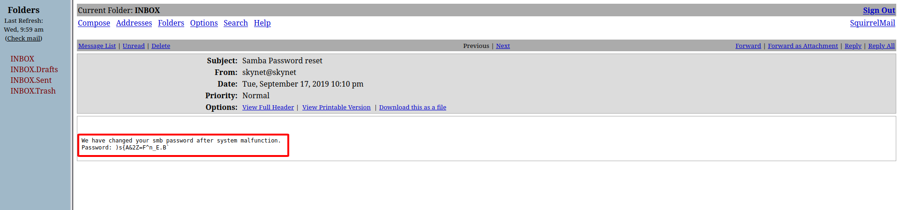

Sử dụng thông tin đăng nhập này đăng nhập vào thư mục share `milesdyson` lúc đầu, bên trong là một số file `PDF` và thư mục `notes`.

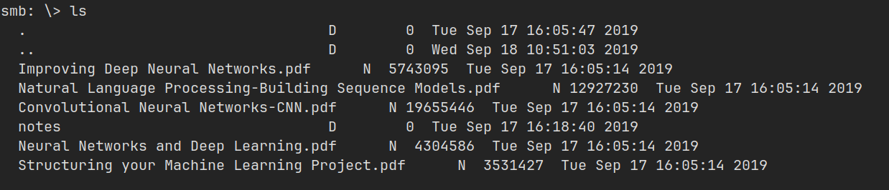

Và trong thư mục `notes` có một đống file khác...

Nhưng đương nhiên, cái gì _**quan trọng**_ thì mình ưu tiên.

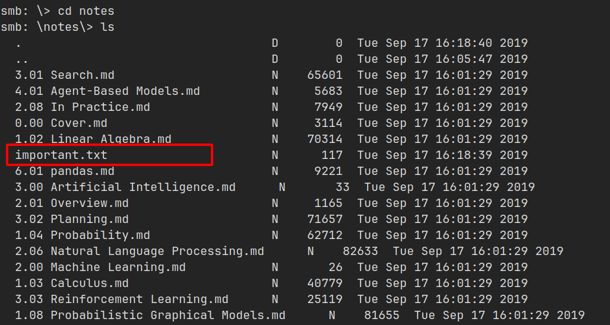

Nội dung bên trong như sau:

```
1. Add features to beta CMS /45kra24xxx28v3yd
2. Work on T-800 Model 101 blueprints
3. Spend more time with my wife
```

Truy cập vào đường dẫn như file ghi, mình được chuyển tới trang như sau.

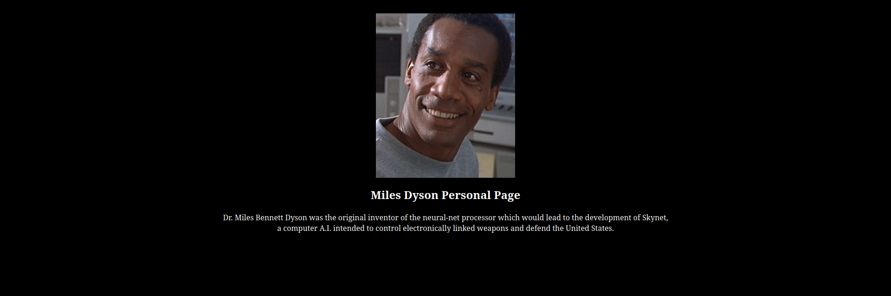

Tiếp tục sử dụng `gobuster` scan tiếp xem bên trong có gì, thì mình phát hiện trang `/administrator`.

```bash
/administrator        (Status: 301) [Size: 341] [--> http://10.201.47.98/45kra24xxx28v3yd/administrator/]
```

Truy cập vào đường dẫn này, mình được chuyển tới một trang đăng nhập cho `administrator`.


## Flag 1

### Lỗ hổng Remote File Inclusion

Tìm trên [ExploitDB](https://www.exploit-db.com) thì nền tảng CMS này từng có một lỗ hổng `Remote File Inclusion`.

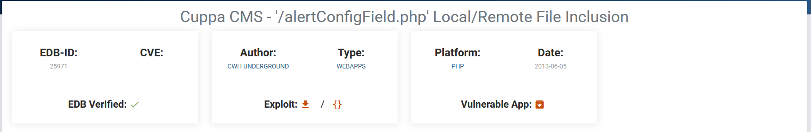

Lỗ hổng này được giải thích như sau:

> Một kẻ tấn công có thể bao gồm (include) các file PHP cục bộ hoặc từ xa, hoặc đọc các file không phải PHP bằng lỗ hổng này. Dữ liệu do người dùng kiểm soát được dùng để tạo tên file sẽ được include vào file hiện tại. Mã PHP trong file đó sẽ được thực thi, mã không phải PHP sẽ được nhúng vào đầu ra. Lỗ hổng này có thể dẫn tới chiếm toàn bộ server.

Nói đơn giản thì máy mục tiêu sẽ lấy file PHP mà mình host và thực thi nó.

### Truy cập www-data và flag

Lỗ hổng này khai thác từ URL `http://target/cuppa/alerts/alertConfigField.php?urlConfig=`.

Phía sau đó sẽ là `Remote` file hoặc `Local` file.

Tại đây, mình host một HTTP Server chứa file PHP độc hại với mục đích mở một `reverse shell` và thực thi lệnh sau để gửi request đến serser (Hoặc cũng có thể thao tác trên browser):

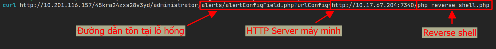

Khi request được gửi, tại listener netcat mình mở sẽ nhận được kết nối ngược lại, mình có quyền truy cập vào `www-data` và tìm thấy flag tại thư mục `/home` của người dùng `milesdyson`.

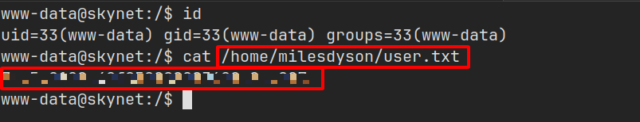

## Flag 2

### Cấu hình sai ở dịch vụ crontab

Sau một lúc kiểm tra thì mình tìm thấy dịch vụ `crontab` đang thực thi một file `backup.sh` dưới quyền `root` mỗi phút một lần.

Đây là một lỗ hổng giúp mình leo thang đặc quyền.

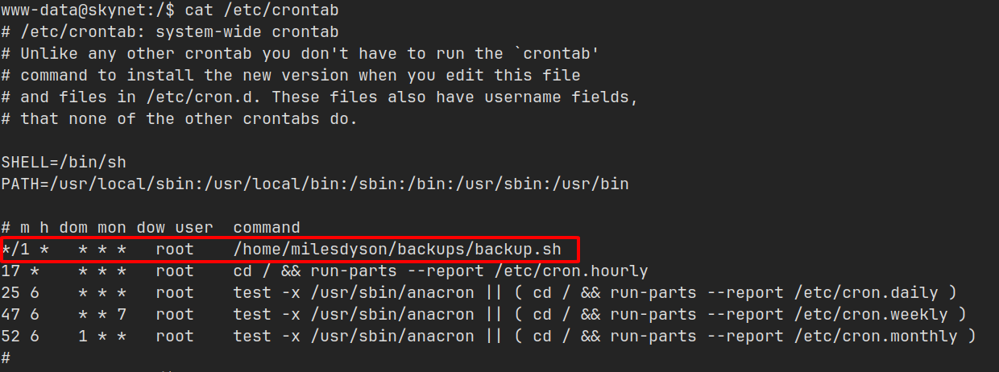

Đối với file này, mình không có quyền ghi nên không thể ghi vào file này để leo thang đặc quyền được.

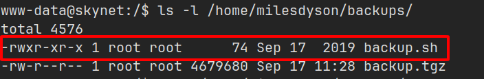

Nhưng có một điều mà người quản lý server này làm rất ẩu, cụ thể file `backup.sh` có nội dung như sau:

```bash
#!/bin/bash
cd /var/www/html
tar cf /home/milesdyson/backups/backup.tgz *
```

File này có nhiệm vụ di chuyển sang thư mục `/var/www/html`, sau đó thực thi lệnh `tar` để nén tất cả mọi thứ trong này lại thành file `backup.tgz`.

Vấn đề nằm ở dấu `* - có nghĩa là tất cả`, mình có thể lợi dụng nó để thực thi file mà mình tạo với mục đích ... 

Khi `tar` bắt đầu thực thi, nếu trong thư mục thực thi (ở đây là /var/www/html) tồn tại file có tên chứa `--` thì nó sẽ coi như đây là một `option` thay vì một file.

### Truy cập người dùng root và flag

Lợi dụng lỗ hổng này, mình tạo một file `reverse shell` về listener netcat mình đang mở và tạo 2 file chứa `--` với mục đích thực thi file `rev-shell.sh`.

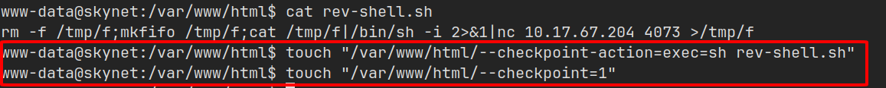

Đợi `crontab` thực thi, mình sẽ có được quyền truy cập vào người dùng `root` và tìm thấy flag tại thư mục `/root`.

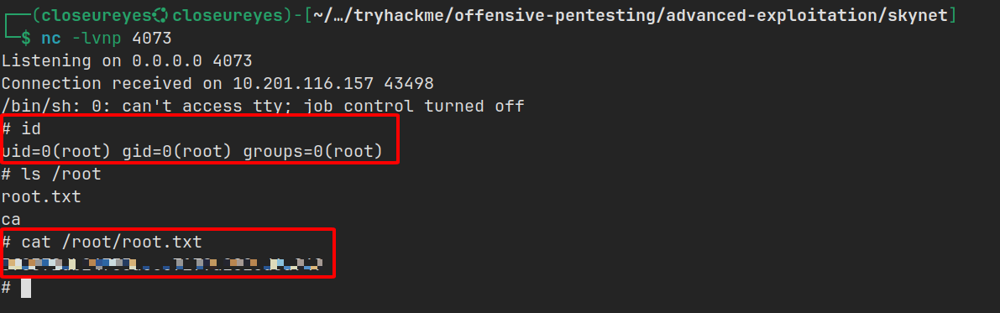
